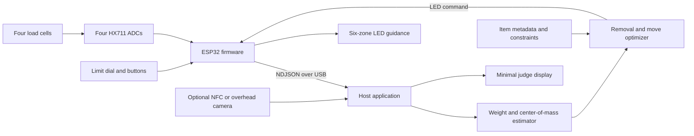
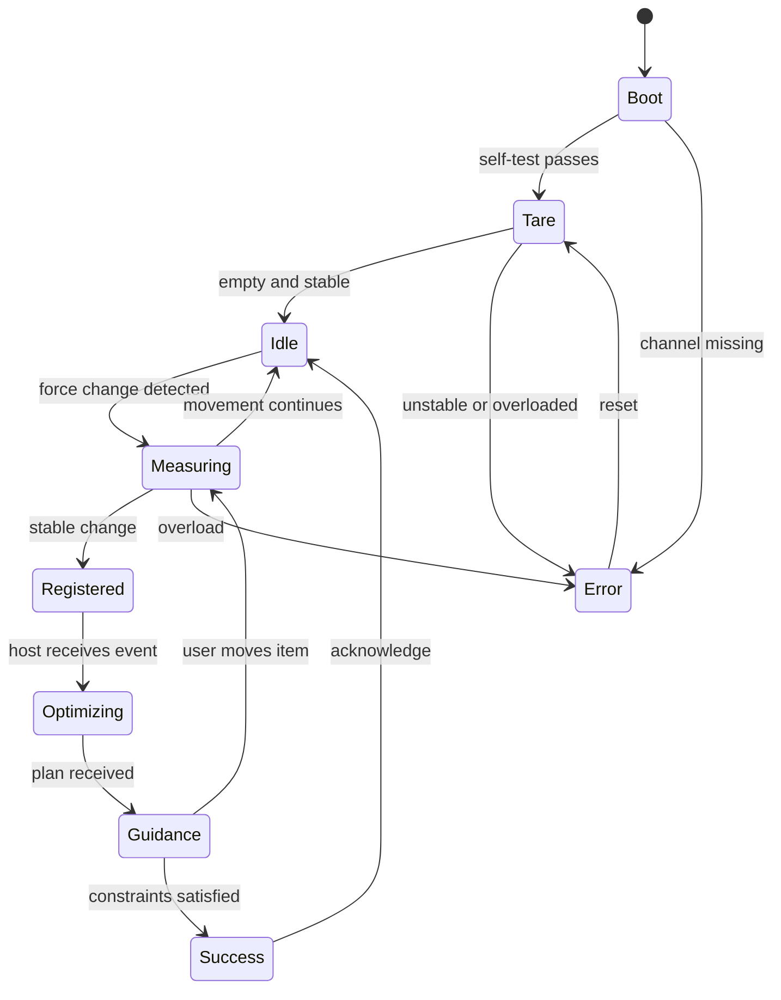

# PackRight: Full Hackathon Build Guide

**Track:** Travelling  
**Team:** ECE + CS + Statistics/ML + related STEM  
**Build window:** under 24 hours  
**Recommended scope:** four independent load cells, six illuminated zones, item check-in, constrained removal/repositioning, and one polished judge-controlled demo

---

## 1. The product in one sentence

**PackRight is an instrumented suitcase that measures total weight and weight distribution, remembers what was packed, and physically guides the traveler toward a lighter, better-balanced arrangement when the baggage limit or trip constraints change.**

### The problem being solved

A conventional luggage scale answers only one question: “How heavy is the bag?” It does not answer the questions that create stress at the airport:

- Which nonessential item should be removed with the least loss of utility?
- Where should a heavy item move to reduce imbalance?
- Can medicine, a laptop, and fragile items remain when the limit changes?
- Did the traveler accidentally add an unregistered heavy object?
- Is the bag balanced for carrying, rolling, or loading?

PackRight turns packing into a measured, constrained decision rather than trial and error.

### Target users

- airline and train travelers facing weight limits;
- travelers with limited lifting strength who benefit from balanced loads;
- families distributing essentials among several bags;
- field technicians, photographers, and medical teams packing priority equipment.

### What the hackathon prototype does

The prototype should:

1. measure four corner forces independently;
2. calculate total weight and planar center of mass;
3. register items as they are placed into the bag;
4. retain item priority and constraints;
5. detect a newly added or removed object;
6. solve an overweight-removal problem;
7. recommend one high-impact move to improve balance;
8. guide the user using LEDs built into the suitcase;
9. show measured improvement after the user acts.

### Explicit non-goals

Do not attempt these in the base build:

- general recognition of arbitrary clothing;
- full 3D packing or folding;
- airline-certified weight measurement;
- motorized rearrangement;
- an autonomous suitcase;
- a social/mobile application;
- generative AI advice.

These would make the build less reliable without strengthening the central demonstration.

---

## 2. Recommended build configuration

The recommended version is a shallow suitcase-shaped tray mounted on four independent load cells. A traveler checks in each demo item, places it into one of six illuminated zones, and the system infers the item’s weight and approximate position from the change in corner forces.



### Why this architecture

- The suitcase remains useful even if the laptop display is hidden.
- Force measurements prove that the physical state changed.
- Item check-in avoids brittle general-purpose vision.
- The optimizer operates on fewer than ten items, so exhaustive search is fast and easy to explain.
- The microcontroller owns sensing and feedback; the laptop owns modeling and presentation.
- Every subsystem can be demonstrated independently if integration slips.

---

## 3. Build variants

### Variant A — Balance-only MVP

**Hardware:** four load cells, four ADCs, ESP32, LEDs, limit dial.  
**Item identity:** user selects the item from the laptop or presses a labeled button before placing it.  
**Capabilities:** total weight, center of mass, mystery-object detection, remove-item recommendation, target-zone guidance.  
**Feasibility:** very high.  
**Choose this when:** the team has less than 18 hours or no camera/NFC hardware.

This is the version that must work before any stretch feature begins.

### Variant B — Tagged PackRight, recommended

Add NFC tags or printed fiducial markers to the six demo items.

- **NFC route:** tap the item at a check-in reader before placing it. This is reliable but needs a PN532 or similar reader.
- **Camera route:** a fixed overhead webcam identifies printed AprilTags/ArUco markers and their locations. This is visually impressive but requires unobstructed tags.

**Feasibility:** high if the base sensor system is already frozen.  
**Choose this when:** the team wants automatic identity and has a working base by hour 10.

### Variant C — Vision-enhanced spatial packing

Use a calibrated overhead camera to identify item rectangles and exact 2D positions. Add fragile zones, non-overlap, and size-aware placement suggestions.

**Feasibility:** medium.  
**Choose this when:** someone already knows OpenCV and the physical objects are flat, rigid, and tagged.  
**Do not claim:** general packing of clothes or arbitrary 3D objects.

### Variant D — Fast fallback using pressure sensors

If four load-cell channels cannot be stabilized, use:

- one conventional luggage scale or one summed four-cell scale for total weight;
- four force-sensitive resistors or pressure pads for quadrant imbalance;
- optional camera positions for the optimizer.

This sacrifices quantitative center-of-mass accuracy but preserves the physical interaction and live guidance.

### Variant E — Real carry-on prototype

Use higher-capacity cells, metal brackets, mechanical overload stops, and a genuine suitcase shell. This looks excellent but consumes fabrication time. Build it only if the team already has suitable mechanical parts.

For a weekend project, a deliberate plywood, acrylic, or foam-board instrumented tray is better than an unstable scale hidden under a real suitcase.

---

## 4. Bill of materials

### Core hardware

| Quantity | Part | Requirement | Purpose | Acceptable substitute |
|---:|---|---|---|---|
| 4 | Four-wire, full-bridge bar load cells | 10 kg recommended for tabletop demo | Independent corner forces | 5 kg cells with a strictly lower demo load; 20 kg cells for a heavier bag |
| 4 | HX711 load-cell ADC boards | One per independent four-wire cell | Amplification and 24-bit conversion | Two dual-channel NAU7802 boards plus an I²C multiplexer; four other bridge ADCs |
| 1 | ESP32 development board | At least 9 usable GPIOs if each HX711 has separate clock/data | Sensor acquisition, controls, LEDs | RP2040, Arduino Mega, Teensy |
| 1 | Addressable RGB LED strip | 30–60 LEDs, 5 V | Six-zone feedback and state indication | Six RGB modules, LED matrix, ordinary LEDs per zone |
| 1 | 74AHCT125 or 74HCT245 | 3.3-to-5 V logic-level shifting | Reliable LED data | A known 3.3 V-compatible LED strip; short-wire direct drive as emergency fallback |
| 1 | Rotary encoder or potentiometer | Physical, easy to label | Baggage-limit control | Two pushbuttons or preset selector switch |
| 2–3 | Pushbuttons | Tare, confirm/check-in, reset | Physical control | Keyboard controls during early integration |
| 1 | 5 V DC supply | 2 A is ample for a dim 30-pixel strip and controller | LED/controller power | Quality USB supply; separate USB power for MCU |
| 1 | USB cable | Data-capable | MCU-to-laptop link | Wi-Fi, but USB is preferred for reliability |
| 1 | Laptop | Python and browser capable | Optimizer, logging, optional vision, UI | Raspberry Pi if already configured |
| 1 | Webcam, optional | Fixed focus/exposure preferred | Tag detection and spatial view | Laptop camera on a stand |
| 1 | NFC reader, optional | PN532-class module | Item check-in | Camera tags, barcode scanner, manual item buttons |

### Electrical and mechanical consumables

- 300–500 Ω resistor in series with the first addressable-LED data input;
- 500–1000 µF electrolytic capacitor across LED 5 V and ground;
- breadboard or protoboard;
- hookup wire, heat-shrink tubing, solder, headers, screw terminals;
- two rigid plates approximately 450 × 300 mm;
- load-cell spacers, M4/M5 fasteners matched to the selected cells, washers, and locknuts;
- four rubber feet beneath the load-bearing points;
- standoffs or foam tape for electronics that do not carry load;
- strain relief, cable clips, and zip ties;
- printed six-zone liner and item labels;
- known calibration weights;
- six weighted demo blocks or containers.

### Tools

- soldering iron and solder;
- multimeter;
- drill and bits or laser cutter access;
- screwdriver/hex-key set;
- ruler and square;
- hot glue for non-load-bearing cosmetic parts only;
- kitchen or postal scale for checking calibration weights;
- optional oscilloscope or logic analyzer.

### Indicative cost

Expect roughly **$70–$130** if purchasing the MCU, four sensors/ADCs, LED strip, power components, and basic mechanical materials at normal US hobbyist prices; a webcam and laptop are excluded. Current official examples list an HX711 board around $5, a small load cell around $4, a one-meter 30-pixel strip around $10, and an ESP32 Feather-class board around $15–$20. Treat these as orientation only and use available lab parts. [SparkFun HX711](https://www.sparkfun.com/sparkfun-load-cell-amplifier-hx711.html), [Adafruit load cell](https://www.adafruit.com/product/4541), [Adafruit LED strip](https://www.adafruit.com/product/2535), [Adafruit ESP32 example](https://www.adafruit.com/product/5933).

### Critical purchasing distinction

**Do not connect four corner cells through one combinator and expect four force readings.** A combinator plus one HX711 intentionally sums the sensors into one scale reading. PackRight needs four independent reaction forces, so use one independent ADC channel per full-bridge cell. SparkFun’s combinator documentation confirms that its four-sensor configuration produces a combined weight output. [SparkFun load-cell guide](https://learn.sparkfun.com/tutorials/load-cell-amplifier-hx711-breakout-hookup-guide/all).

---

## 5. Mechanical construction

Mechanical quality determines measurement quality. Build this before polishing software.

### Recommended dimensions

- lower base: approximately 450 × 300 × 12 mm plywood or MDF;
- upper luggage tray: same footprint or slightly smaller;
- support rectangle between sensor centers: measure precisely and record as `B` by `L`;
- six visible zones: 2 columns × 3 rows;
- maximum prototype load: label it clearly based on the selected cells and mounting.

### Top view

```text
              rear / hinge side

       RL o-------------------------o RR
          |   Z4      |     Z5      |
          |-----------+-------------|
          |   Z2      |     Z3      |
          |-----------+-------------|
          |   Z0      |     Z1      |
       FL o-------------------------o FR

              front / handle side
```

The `o` locations are the centers of the four load-bearing cells or pads. LEDs should outline or label the zones without mechanically bridging the upper and lower plates.

### Mounting bar load cells

1. Fasten the fixed end of each cell to the lower base.
2. Use a rigid spacer at the active end to support the upper plate.
3. Observe the force direction marked on the cell.
4. Ensure the upper plate contacts the base only through the four cells.
5. Route wires loosely enough that they do not pull on the active beams.
6. Add a mechanical overload stop with a small clearance if practical.
7. Add rubber feet directly beneath or close to the four sensor locations.

Adafruit recommends selecting a cell with at least twice the maximum force expected on that individual cell and calibrating it after installation. A highly off-center object can put most of the bag’s force on one corner, so size each corner sensor for the worst case—not one quarter of total capacity. [Adafruit four-wire load cell](https://www.adafruit.com/product/4541).

### Mechanical checks before wiring all channels

- The upper plate does not rock when empty.
- Pressing one corner produces obvious strain only near that corner.
- No screw, LED strip, cable, or enclosure wall forms a second load path.
- The cell bodies cannot twist sideways.
- The platform returns to the same empty position after loading.
- A heavy object never contacts the lower plate.

### If using a real suitcase

Mount the instrumented platform as a removable false bottom. Do not depend on a flexible textile shell for force transfer. The scale should be a rigid module that the suitcase contains, not four loose sensors glued to fabric.

---

## 6. Electrical design and wiring

### One-cell signal path

```text
Load cell E+ ───── HX711 E+
Load cell E- ───── HX711 E-
Load cell A+ ───── HX711 A+
Load cell A- ───── HX711 A-

HX711 VCC/VDD ─── supply specified by the breakout
HX711 GND ─────── ESP32 GND
HX711 DOUT ────── ESP32 GPIO
HX711 SCK ─────── ESP32 GPIO
```

Load-cell wire colors are not universal. Follow the selected cell’s documentation or identify excitation and signal pairs with a multimeter. SparkFun specifically warns that hacked-scale wire colors can differ. [SparkFun HX711 hookup guide](https://learn.sparkfun.com/tutorials/load-cell-amplifier-hx711-breakout-hookup-guide/all).

### Recommended ESP32 pin map

This is an example, not a universal board pinout. Verify that the pins are available and not reserved on the chosen development board.

| Function | Example GPIO |
|---|---:|
| HX711 FL data | 32 |
| HX711 FL clock | 33 |
| HX711 FR data | 25 |
| HX711 FR clock | 26 |
| HX711 RL data | 27 |
| HX711 RL clock | 14 |
| HX711 RR data | 12 |
| HX711 RR clock | 13 |
| LED data | 18 |
| Limit potentiometer | 34, input only |
| Tare button | 21 |
| Confirm/check-in button | 22 |
| Emergency reset | EN/reset or separate button |

Using separate clocks is the easiest firmware path. A shared clock can reduce pins, but only if the library and reading sequence are deliberately designed for it.

### Addressable LED wiring

```text
5 V supply +  ───────────── LED +5 V
5 V supply -  ──┬───────── LED GND
                └───────── ESP32 GND

ESP32 GPIO18 → 74AHCT125 level shifter → 330 Ω → LED DIN
500–1000 µF capacitor across LED +5 V and GND near strip input
```

Limit global brightness in firmware. Addressable RGB pixels may draw up to roughly 60 mA each at full white; 30 pixels can therefore approach 1.8 A in the worst case. Adafruit recommends a 300–500 Ω data resistor, a 500–1000 µF supply capacitor, common ground, and a logic-level shifter for a 3.3 V MCU driving 5 V pixels. [NeoPixel best practices](https://learn.adafruit.com/adafruit-neopixel-uberguide/best-practices), [power guidance](https://learn.adafruit.com/adafruit-neopixel-uberguide/powering-neopixels).

### Grounding and noise control

- Use a common ground between the MCU, ADC boards, and LEDs.
- Keep load-cell signal wires away from LED power leads.
- Twist each cell’s signal pair if possible.
- Place ADC boards close to their cells or use shielded cable.
- Do not run LED animations while capturing the final calibration sample if noise is visible.
- Add strain relief to every sensor cable.
- Use soldered connections for the final demo, not loose alligator clips.

### Sampling rate

Use the HX711’s lower-noise 10 samples/second mode unless responsiveness is visibly poor. SparkFun documents 10 SPS as the lower-noise default and 80 SPS as faster but noisier. Ten samples per second is enough for a user placing and settling luggage. [SparkFun OpenScale guide](https://learn.sparkfun.com/tutorials/openscale-applications-and-hookup-guide).

---

## 7. Firmware design

### Responsibilities

The microcontroller should do only reliable real-time work:

- read all four ADCs;
- apply stored zero and scale coefficients;
- filter measurements;
- detect stable-versus-moving state;
- read buttons and the limit dial;
- drive LEDs;
- send telemetry;
- accept a small set of host commands;
- watchdog and return to a safe display state after communication loss.

Do not put the packing optimizer in the MCU unless the laptop integration fails.

### Firmware state machine



### Filtering pipeline

For each channel:

1. reject an unavailable or obviously saturated read;
2. subtract the zero offset;
3. multiply by that channel’s calibration gain;
4. take a five-sample median;
5. apply an exponential moving average, initially `alpha = 0.2–0.35`;
6. clamp very small negative values to zero only after preserving them in diagnostic logs.

Do not hide large negative values; they usually indicate reversed wiring, a bad tare, or mechanical preload.

### Stability detection

Maintain a rolling 0.6–1.0 second window. Declare the platform stable when:

- total-weight standard deviation is below a tuned threshold;
- no individual channel is changing rapidly;
- total weight is above the minimum object threshold; and
- the condition persists for several samples.

Start with a 20–40 g standard-deviation threshold for a small demo and tune from measurements. The UI should say **“Hold still…”** rather than committing a placement prematurely.

### Serial protocol

Use newline-delimited JSON over USB so logs are human-readable and recovery is simple.

Telemetry example:

```json
{"t_ms":43120,"state":"stable","f_g":[820,910,630,740],"total_g":3100,"limit_g":3500,"buttons":0}
```

Event example:

```json
{"event":"mass_change","delta_g":505,"x_mm":382,"y_mm":91,"stable_ms":800}
```

Host command examples:

```json
{"cmd":"tare"}
{"cmd":"set_guidance","source_zone":1,"target_zone":4,"item_id":"bottle"}
{"cmd":"set_state","value":"success"}
{"cmd":"set_brightness","value":0.20}
```

Add a monotonically increasing message ID if commands need acknowledgement. Ignore malformed commands and keep sending telemetry.

### LED language

Color should never be the only signal; pair it with location and motion.

| State | LED behavior |
|---|---|
| Boot | one short white sweep |
| Tare needed | all zones pulse slowly in blue |
| Ready | dim outline |
| Weight change / hold still | yellow perimeter chase |
| Overweight | red perimeter plus numeric display |
| Source item | amber pulse in the current zone |
| Target zone | green inward sweep in destination zone |
| Success | two green perimeter sweeps, then dim |
| Sensor error | affected corner flashes red/white |
| Host disconnected | steady blue corner markers; sensing continues |

Avoid endless rainbow animations. The object should look like an instrument, not decorative lighting.

---

## 8. Calibration

Calibration must occur after final mechanical assembly.

### Step 1: channel sanity

With the platform empty, press gently above each corner. The corresponding force should increase most strongly. If the sign is reversed, swap the signal pair or invert the software coefficient.

### Step 2: tare

Collect 50–100 stable samples with the empty upper plate installed. Store the median raw value as each channel’s zero offset.

### Step 3: individual gain calibration

Place a known mass directly over one support at a time. For channel `i`:

```text
gain_i = known_mass / (loaded_raw_i − zero_raw_i)
force_i = gain_i × (raw_i − zero_raw_i)
```

Repeat at two masses if possible and fit a line. If the gain differs substantially with weight, inspect mechanics before adding a nonlinear correction.

### Step 4: combined calibration

Place a known mass at:

- center;
- each corner, safely inside the support rectangle;
- midpoint of each edge;
- two arbitrary locations.

Record predicted total and center of mass. Adjust individual gains only from systematic error—not one noisy sample.

### Step 5: coordinate calibration

Let the corner support coordinates be:

```text
FL = (0, 0)
FR = (B, 0)
RL = (0, L)
RR = (B, L)
```

where `B` is the left-to-right distance and `L` is the front-to-rear distance between effective support points.

For forces `F_FL`, `F_FR`, `F_RL`, and `F_RR`:

```text
W_total = F_FL + F_FR + F_RL + F_RR

x_com = B × (F_FR + F_RR) / W_total
y_com = L × (F_RL + F_RR) / W_total
```

These equations assume a rigid platform, static vertical loading, rectangular supports, and no external contact.

### Step 6: added-item position

When a single object is added, calculate the change in each corner force:

```text
ΔF_i = F_i_after − F_i_before
ΔW = Σ ΔF_i

x_item = B × (ΔF_FR + ΔF_RR) / ΔW
y_item = L × (ΔF_RL + ΔF_RR) / ΔW
```

The same calculation works for removal if the signed changes are retained. Require a meaningful `|ΔW|` to avoid division by noise.

### Important observability limitation

Four force measurements reveal the **combined center of mass**, not the independent positions of every object. PackRight can infer a single item’s position from the before/after difference when that item alone is added or removed. It cannot reconstruct several simultaneous rearrangements without tags, a camera, or user confirmation. State this honestly in the presentation.

### Drift management

- Provide a physical tare button.
- Auto-tare only when the bag is known to be empty.
- Never silently auto-tare a loaded bag.
- Re-zero after moving the entire device or changing temperature substantially.
- Keep a “raw sensors” diagnostic view for debugging.

SparkFun notes that temperature, creep, vibration, drift, and mechanical interference can produce appreciable load-cell error, so easy recalibration is part of the design, not an afterthought. [SparkFun HX711 guide](https://learn.sparkfun.com/tutorials/load-cell-amplifier-hx711-breakout-hookup-guide/all).

### Prototype acceptance targets

These are reasonable goals, not guaranteed specifications:

- total-weight error: under 2% or 50 g, whichever is larger, over the demo range;
- center-of-mass error: under 30–40 mm for stable, rigid objects;
- correct quadrant detection: at least 18 of 20 placements;
- stable placement detection: under 1.5 seconds after the user releases an item;
- no false placement event during 60 seconds of idle operation;
- successful tare and demo reset in under five seconds.

Use the actual achieved values in the presentation.

---

## 9. Item model and check-in workflow

### Item record

```json
{
  "id": "medicine",
  "label": "Medication",
  "weight_g": 300,
  "priority": 100,
  "must_keep": true,
  "fragile": false,
  "movable": true,
  "x_mm": 110,
  "y_mm": 230,
  "zone": 2
}
```

### Recommended six-item demonstration set

| Item | Mass | Priority | Constraint |
|---|---:|---:|---|
| Laptop block | 1,200 g | 95 | Must keep; fragile |
| Water bottle | 1,000 g | 80 | Keep if possible; good move candidate |
| Shoes | 800 g | 20 | First removal candidate |
| Charger | 400 g | 70 | Keep if possible |
| Medication | 300 g | 100 | Must keep |
| Mystery object | 500 g | 40 default | Added by judge |

The first five total 3,700 g. After the judge adds the mystery item, total mass is 4,200 g. Turning the limit to 3,500 g makes removing the 800 g shoes sufficient while retaining the essential items.

### Manual check-in, simplest

1. Select an item on the host UI.
2. Place it in the suitcase.
3. Wait for stable force change.
4. Store measured mass and inferred position.

### NFC check-in

1. Tap the item tag on a clearly marked reader.
2. The MCU or host announces the expected item.
3. Place the item.
4. The measured weight and position update its record.

NFC adds physical charm but is not a judging requirement.

### Camera-tag check-in

Mount a webcam above the tray. Put a tag on every rigid demo block and four calibration tags at known tray corners. Use the corner markers to compute a planar homography from image pixels to bag coordinates.

The official AprilTag project recommends `tagStandard41h12` for most applications and provides identity, corner, and pose information. Its official package supports Linux; on a Windows hackathon machine, OpenCV’s `aruco` module with a built-in AprilTag or ArUco dictionary may be faster to install. [AprilRobotics AprilTag](https://github.com/AprilRobotics/apriltag), [OpenCV marker detection](https://docs.opencv.org/4.11.0/d5/dae/tutorial_aruco_detection.html).

Camera requirements:

- fixed mount and fixed zoom;
- diffuse lighting without glossy glare;
- tags at least 40–60 mm wide for a normal laptop webcam;
- all corner calibration markers visible;
- item tags not covered during the demonstration;
- a manual check-in fallback.

---

## 10. Optimization design

Use two small optimizers in sequence. This makes the result easier to explain and debug.

### A. Remove-item optimizer

Given total weight `W`, limit `L`, and removable items `i`, choose removals `r_i ∈ {0,1}`:

```text
minimize
    Σ r_i × removal_cost_i
  + λ_count × Σ r_i
  + λ_excess × max(0, W − Σ r_i w_i − L)^2

subject to
    r_i = 0 for must-keep items
    W − Σ r_i w_i ≤ L
```

Set `removal_cost_i` from user priority. For fewer than ten items, enumerate every subset. This avoids dependency and solver risk while remaining mathematically exact for the demo size.

Tie-breaking order:

1. meet the limit;
2. preserve higher-priority items;
3. remove fewer objects;
4. avoid removing fragile or trip-specific items;
5. minimize unused allowance.

### B. Balance-move optimizer

For each movable item `i` and target zone `z`, predict the new center of mass:

```text
c_new = (W × c_current − w_i × p_i + w_i × p_z) / W
```

Score the move:

```text
J_move = λ_balance × ||c_new − c_target||²
       + λ_effort × distance(p_i, p_z)
       + λ_fragile × fragile_violation
       + λ_zone × zone_capacity_violation
```

Select the single move with the largest improvement. One excellent recommendation is more credible than asking the user to rearrange everything.

### Target modes

- **Carry mode:** target the geometric center.
- **Roll mode:** target the centerline and bias mass toward the wheel end.
- **Fragile mode:** preserve a designated protected zone and avoid placing heavy items there.
- **Airport mode:** satisfy the weight limit first, then improve balance.

The physical selector should expose no more than two modes during judging.

### Normalized imbalance score

For a target `(x_t, y_t)`:

```text
d = sqrt((x_com − x_t)² + (y_com − y_t)²)
d_max = distance from target to farthest support corner
balance_score = 100 × max(0, 1 − d / d_max)
```

Use the score only as a presentation aid. The raw distance in centimeters is the more meaningful measurement.

### Pseudocode

```text
on stable_mass_change(delta_forces):
    delta_weight, position = infer_change(delta_forces)
    update_inventory(delta_weight, position, pending_item)

    removals = enumerate_feasible_removal_subsets(inventory, limit)
    best_removal = argmin(removal_objective, removals)

    remaining = inventory minus best_removal
    candidate_moves = every movable item × every allowed zone
    best_move = argmin(move_objective, candidate_moves)

    if overweight:
        guide_remove(best_removal)
    else if best_move improves balance enough:
        guide_move(best_move)
    else:
        show_success()
```

### Optional 2D packing stretch

If the camera reliably gives item rectangles, add non-overlap and zone-boundary constraints. A CP-SAT or integer-programming model is appropriate, but only after the remove-and-balance loop is polished. Judges will reward a functioning physical optimizer more than an ambitious packing solver shown on slides.

---

## 11. Host application

### Recommended stack

- Python 3;
- `pyserial` for MCU communication;
- a small FastAPI/Flask server or a direct desktop script;
- browser UI using ordinary HTML/CSS/JavaScript;
- OpenCV only for the optional tag path;
- JSON/CSV logging;
- exhaustive-search optimizer using the standard library or NumPy.

Avoid a cloud dependency. Run everything on localhost.

### Suggested repository structure

```text
packright/
├── firmware/
│   ├── packright_esp32.ino
│   ├── calibration.h
│   └── led_patterns.h
├── host/
│   ├── app.py
│   ├── serial_bridge.py
│   ├── estimator.py
│   ├── optimizer.py
│   ├── inventory.py
│   └── vision.py              # optional
├── web/
│   ├── index.html
│   ├── styles.css
│   └── app.js
├── config/
│   ├── items.json
│   ├── geometry.json
│   └── calibration.json
├── data/
│   ├── calibration.csv
│   └── demo_trials.csv
├── assets/
│   ├── tag-images/
│   └── zone-layout.pdf
└── README.md
```

### UI hierarchy

The judge display should contain only:

1. a suitcase outline with current center of mass;
2. total weight versus limit;
3. one instruction: “Remove shoes” or “Move bottle to rear-left”; and
4. one before/after metric.

Put raw channels, logs, camera tuning, and calibration behind a hidden engineering view. Do not make judges read a dashboard.

### Recovery behavior

- Automatically reconnect serial after USB interruption.
- Keep the last valid calibration in a file and in MCU flash if possible.
- Provide a one-click full demo reset.
- Time out a pending check-in after ten seconds.
- If vision fails, switch to manual identity without restarting.
- If the host disconnects, the MCU should show a calm disconnected state rather than freezing random LEDs.

---

## 12. 24-hour execution plan

### Milestone gates

| Time | Required outcome | Kill or cut decision |
|---:|---|---|
| Hour 1 | One sensor produces stable readings under a mounted plate | If not, change ADC/cell or use the pressure-sensor fallback |
| Hour 4 | All four channels identify the correct pressed corner | If not, stop UI work and fix mechanics/wiring |
| Hour 7 | Weight and center-of-mass calculation responds correctly at five positions | If inaccurate, enlarge zones and target quadrant classification |
| Hour 10 | Limit change produces a correct remove-item choice | Freeze optimizer features |
| Hour 13 | LEDs guide one move and success is detected | This is the complete MVP |
| Hour 16 | Ten end-to-end resets succeed | Only now add NFC or camera tags |
| Hour 20 | Final physical appearance and metrics complete | Feature freeze |
| Hour 22 | Demo consistently ends under 2:40 | Fix only blockers; record backup video |
| Hour 24 | Presentation-ready | No new code |

### Parallel ownership

#### ECE major

- sensor selection and wiring;
- mechanical/electrical integration with the fabrication lead;
- ADC acquisition, filtering, tare, and calibration;
- LED power and reliability;
- overload and disconnect detection.

#### CS major

- serial protocol and host state machine;
- item inventory;
- browser display;
- reset/reconnect behavior;
- optional camera-tag pipeline.

#### Statistics/ML major

- center-of-mass model validation;
- removal/move objective and baselines;
- experimental design and error analysis;
- stability thresholds;
- final quantitative results.

#### Related STEM major

- load-bearing mechanical design with ECE;
- item props and zone liner;
- target-user story and usability;
- testing, logging, enclosure, and demo direction;
- presenter or live-demo operator.

Pair ECE and CS on the first end-to-end telemetry packet. Pair Statistics/ML and STEM on the first five-position calibration dataset. No one should work on slides before the MVP loop exists.

---

## 13. Testing plan

### Sensor tests

1. Empty drift for five minutes.
2. Repeat a known center weight ten times.
3. Place the same weight in each zone.
4. Load one corner near the planned maximum.
5. Tap and shake the table; verify no placement is registered until stable.
6. Disconnect one ADC; verify the error identifies the corner.
7. Run LEDs at demo brightness and check whether readings shift.

### Estimation tests

Create a grid of at least nine known positions. For each, record:

- true mass and coordinate;
- measured total mass;
- estimated coordinate;
- absolute weight error;
- Euclidean position error;
- predicted zone.

Report mean absolute error and correct-zone rate. Do not cherry-pick only the best points.

### Optimizer tests

- overweight by less than the lightest removable item;
- two low-priority items versus one medium-priority item;
- all low-priority items marked must-keep;
- exactly at the limit;
- no feasible removal plan;
- center of mass already at target;
- best move would violate the fragile zone;
- newly added unregistered object.

When no feasible plan exists, say so explicitly rather than returning nonsense.

### Reliability tests

Run the complete demo ten times, including:

1. tare;
2. initial pack;
3. judge mystery placement;
4. limit change;
5. removal;
6. repositioning;
7. success;
8. reset.

The demo is not frozen until at least nine of ten runs succeed without touching source code.

### Metrics to show judges

Choose three at most:

- weight mean absolute error;
- center-of-mass error or correct-zone rate;
- before/after distance from balance target;
- time from stable placement to guidance;
- utility retained versus “remove the heaviest item” baseline.

The strongest baseline is useful but naive: remove the heaviest removable item, then compare the priority/utility retained by PackRight.

---

## 14. Failure modes and mitigations

| Failure | Likely cause | Immediate mitigation | Structural fix |
|---|---|---|---|
| Weight changes when LEDs animate | shared-supply noise or grounding | freeze animation during stable sample | separate LED supply branch, common ground, better routing |
| One corner reads negative | reversed signal pair or preload | invert sign only after verifying press response | correct wiring or remount cell |
| All corners change equally when one is pressed | sensors combined into one bridge or rigid secondary contact | inspect wiring and plates | use independent ADCs and remove second load path |
| Weight drifts upward | cell creep, temperature, mechanical settling | manual tare while empty | stabilize mechanics and allow warm-up |
| Center of mass is mirrored | corner labels or axes swapped | swap mapping in configuration | physically relabel channels |
| False item events | table bumps or threshold too low | increase stable time/threshold | better feet, median filter, rigid base |
| Judge adds two objects together | difference model observes only their combined center | call it one mystery bundle | request one-at-a-time placement or enable camera |
| Suggested item cannot be found | identity not tied to position | show label and last-known zone | NFC check-in or camera tags |
| Camera loses tags | glare, occlusion, movement | manual identity mode | larger tags, fixed exposure, higher mount |
| Serial cable disconnects | mechanical pull or port reset | reconnect automatically | cable strain relief and fixed port selection |
| Optimizer oscillates between moves | score improvement too small | require minimum improvement threshold | add movement cost and hysteresis |
| User exceeds prototype capacity | unclear limit | visible overload message | mechanical stop and conservative rated limit |

---

## 15. Safety and honesty

- Operate only at low voltage.
- Fuse or current-limit the LED power branch if practical.
- Insulate solder joints and exposed supply conductors.
- Label the prototype maximum mass.
- Do not allow anyone to stand or sit on the platform.
- Add mechanical overload stops where possible.
- Use a rigid carrying base; do not lift the prototype by loose wires or textile.
- Tare only while empty.
- Do not represent the prototype as a legal-for-trade or airline-certified scale.
- Do not claim medical benefits from better balance.
- Label simulated inputs and constraints as simulated.
- Record actual demo metrics; do not use invented accuracy figures.

Adafruit’s scale guidance likewise cautions that hobbyist load-cell builds should not be used for safety, health, scientific, or commercial measurement without appropriate validation. [Adafruit coffee-scale guide](https://learn.adafruit.com/clue-coffee-scale/overview).

---

## 16. Judge-facing demo

### Physical stage layout

- PackRight centered at the front of the table.
- Six item blocks arranged in a neat row to one side.
- Laptop behind the suitcase, not blocking it.
- Weight-limit dial on a raised, clearly labeled panel.
- Ordinary luggage scale hanging beside the setup as the baseline prop.
- One large printed sentence: **“A scale says you failed. PackRight tells you what to do.”**

### Exact three-minute sequence

#### 0:00–0:18 — Hook

“Travelers usually learn their bag is overweight after they finish packing. A normal scale provides a number but no recovery plan. PackRight measures what changed, protects essential items, and physically guides a better pack.”

#### 0:18–0:45 — Show the instrument

Point to the four corner sensors and six LED zones. Place the known items quickly or begin with them already registered. The laptop shows 3.7 kg and a visible off-center dot.

#### 0:45–1:12 — Judge-controlled mystery

Hand the 500 g mystery object to a judge: “Place this anywhere.” The corresponding corner forces rise, its approximate location appears, and the nearest zone pulses.

#### 1:12–1:35 — Change the constraint

Ask the judge to turn the baggage-limit dial from 4.5 kg to 3.5 kg. The border turns red. PackRight immediately recommends removing the 800 g shoes, preserving medication and laptop.

#### 1:35–1:58 — Remove intelligently

Remove or scan out the shoes. Total falls to 3.4 kg. The system then identifies the bottle as the best balance move and pulses its current zone in amber.

#### 1:58–2:20 — Physical guidance

Follow the green sweep and reposition the bottle into the target zone. The measured center of mass moves toward target and the border turns green.

#### 2:20–2:42 — Evidence

Show:

- measured weight error from calibration;
- center-of-mass distance before and after;
- utility retained versus removing the heaviest nonessential object.

#### 2:42–2:58 — Close

“The software did not merely draw a packing diagram. Four physical force measurements verified the result. PackRight transforms a luggage scale from a pass/fail test into an actionable travel instrument.”

### Demo rules

- Rehearse to 2:35–2:45, leaving recovery time.
- Let the judge perturb exactly one variable at a time.
- Do not explain equations until after the physical transformation.
- Keep the engineering view closed unless asked.
- Have a second pre-calibrated configuration file.
- Record one clean backup video but demo live.
- Carry spare labeled blocks, USB cables, and one extra HX711.

---

## 17. How to maximize each judging category

### Originality

- Lead with closed-loop physical guidance, not “smart luggage.”
- Emphasize the before/after force measurement and judge-created disturbance.
- Avoid generative AI entirely.
- Use coarse zones honestly instead of pretending to solve arbitrary 3D packing.

### Technical difficulty

- Expose the four-channel calibration and force-equilibrium model.
- Show the constrained subset optimizer and move prediction.
- Explain stability detection, drift, and physical error evaluation.
- Demonstrate automatic recovery after an item move.

### Demo quality

- Put the main feedback inside the suitcase.
- Give the judge the mystery weight and limit dial.
- Use bright, purposeful lighting and polished blocks.
- Show one physical transformation and one numerical confirmation.

### Usefulness

- Compare directly with a conventional scale.
- Preserve medication and laptop while removing a low-priority object.
- Make the recommendation actionable in seconds.
- Mention field-equipment and family multi-bag applications only after the travel use case is established.

### Track relevance

- Use airline/train baggage limits as the inciting constraint.
- Frame balance modes around carrying and rolling.
- Keep the suitcase, packing items, and traveler interaction visible throughout.

---

## 18. Variations and future extensions

### Low-vision PackRight

Replace or supplement LEDs with directional vibration modules on the suitcase rim and spoken numeric confirmation. Preserve physical buttons and textured zone markers. This is a strong variation only if tested thoughtfully; do not claim accessibility without user input.

### Family luggage optimizer

Place load platforms beneath two bags and distribute items across them while protecting shared essentials. The solver minimizes overweight penalties and splits essential items to reduce single-bag failure risk. This is more novel but doubles hardware.

### Backpack ergonomics mode

Use a vertical or angled sensor fixture and target heavy items close to the back and within a preferred height band. This requires a different mechanical model; do not bolt the claim onto the flat prototype.

### Photographer or field-engineer mode

Assign high cost to fragile lenses or tools, require redundant batteries, and optimize around a mission-specific checklist. This improves usefulness without changing hardware.

### Airline check-in station

Turn the system into a counter-side repacking surface with large zones, multilingual physical icons, and privacy-preserving local operation.

### Sustainability variation

Track frequently unused items across trips and suggest leaving low-utility weight behind. This needs longitudinal data and is not a weekend MVP.

### Actuated future version

A tilting or vibrating tray could physically shift standardized cargo blocks to the target zone. It would be spectacular but is unsuitable for loose personal belongings and substantially increases safety risk.

---

## 19. Likely judge questions

### “Why not use a normal luggage scale?”

A normal scale measures only total weight. PackRight also estimates load distribution, remembers item priority, selects what to remove under a changed constraint, and verifies that the physical correction worked.

### “How do you know where every item is?”

The base system infers a single item’s position from the difference in four corner forces when that item is added or removed. The tagged version uses NFC for identity, and the vision variation uses fixed fiducial tags for continuous position. We do not claim that four load cells alone reconstruct arbitrary multi-item arrangements.

### “Is the packing optimizer really necessary?”

Yes when constraints conflict. Removing the heaviest item may discard a laptop or medication. PackRight solves for legal weight while minimizing priority loss, then chooses the move with the best balance improvement per unit of effort.

### “Where is the machine learning?”

It is intentionally unnecessary. This is a sensing, estimation, and constrained-optimization problem. Avoiding an unjustified model is part of the engineering decision.

### “Would this work with clothes?”

Weight and center-of-mass measurement would. Automatic identity and exact geometry would require tags, structured check-in, or better sensing. The prototype demonstrates the measurable decision loop with rigid representative objects.

### “How accurate is it?”

Answer with the measured test-set values from the completed build. Explain that this is a prototype, not a certified commercial scale.

### “What happens if the traveler ignores the recommendation?”

The system keeps measuring, updates the inventory from the observed change, and replans. If it cannot identify the change, it asks the user to confirm the item rather than guessing.

### “What is the hardest technical part?”

Reliable center-of-mass estimation from imperfect physical sensors: mechanical isolation, per-channel calibration, drift handling, stable-event detection, and converting measurements into a recommendation that improves the next measured state.

---

## 20. Submission language

### 30-second pitch

“A luggage scale tells travelers they are overweight only after packing, but it cannot tell them what to do. PackRight uses four independent force sensors to measure total weight and balance, remembers the priority of each packed item, and solves for the lowest-cost removal and highest-impact move. LEDs inside the suitcase guide the correction, and the same sensors verify that it worked.”

### Track-relevance statement

“PackRight directly improves the physical act of preparing for travel. It measures baggage weight and balance, protects essential and fragile items, and optimizes what to remove or reposition when a travel limit changes. Unlike a packing checklist or ordinary scale, it guides and verifies the traveler’s real-world repacking decisions.”

### One-line close

**A scale says you failed; PackRight tells you what to do next.**

---

## 21. Final pre-demo checklist

### Hardware

- [ ] all four channels increase under load;
- [ ] corner mapping is correct;
- [ ] no plate contact bypasses sensors;
- [ ] wires are strain-relieved;
- [ ] LED supply and MCU share ground;
- [ ] brightness is capped;
- [ ] overload limit is labeled;
- [ ] tare and reset buttons work;
- [ ] spare ADC, USB cable, and jumpers are packed.

### Software

- [ ] calibration loads automatically;
- [ ] serial reconnects without restarting;
- [ ] demo inventory resets in one action;
- [ ] no-solution state is handled;
- [ ] manual item identity works if NFC/camera fails;
- [ ] all logs contain timestamps and raw forces;
- [ ] the browser runs entirely on localhost;
- [ ] the screen cannot sleep during judging.

### Evidence

- [ ] at least nine calibration positions recorded;
- [ ] weight and position error calculated;
- [ ] baseline comparison completed;
- [ ] before/after balance improvement measured;
- [ ] no invented or unrepeatable metric appears.

### Presentation

- [ ] live sequence completes under 2:45;
- [ ] judge interaction is one sentence;
- [ ] physical item labels are readable from several feet away;
- [ ] ordinary scale baseline is visible;
- [ ] backup video is local and queued;
- [ ] one teammate owns reset/recovery;
- [ ] every teammate can answer the observability limitation honestly.

---

## 22. Source notes

- [SparkFun HX711 hookup guide](https://learn.sparkfun.com/tutorials/load-cell-amplifier-hx711-breakout-hookup-guide/all): Wheatstone-bridge wiring, four-sensor combinator behavior, calibration, wiring variability, and measurement error sources.
- [SparkFun HX711 product page](https://www.sparkfun.com/sparkfun-load-cell-amplifier-hx711.html): operating voltage and selectable 10/80 SPS rates.
- [SparkFun OpenScale guide](https://learn.sparkfun.com/tutorials/openscale-applications-and-hookup-guide): lower-noise 10 SPS versus faster 80 SPS operation.
- [Adafruit NAU7802 guide](https://learn.adafruit.com/adafruit-nau7802-24-bit-adc-stemma-qt-qwiic): alternative 24-bit load-cell ADC and I²C considerations.
- [Adafruit load-cell page](https://www.adafruit.com/product/4541): mounting direction, calibration requirement, and capacity-selection guidance.
- [Adafruit scale example](https://learn.adafruit.com/clue-coffee-scale/overview): tare/calibration approach and prototype-measurement caveat.
- [Adafruit NeoPixel best practices](https://learn.adafruit.com/adafruit-neopixel-uberguide/best-practices): data resistor, power capacitor, level shifting, common ground, and wiring precautions.
- [AprilRobotics AprilTag repository](https://github.com/AprilRobotics/apriltag): official fiducial detector and tag-family guidance.
- [OpenCV marker-detection documentation](https://docs.opencv.org/4.11.0/d5/dae/tutorial_aruco_detection.html): alternative deterministic tag-detection path.
