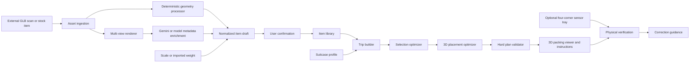
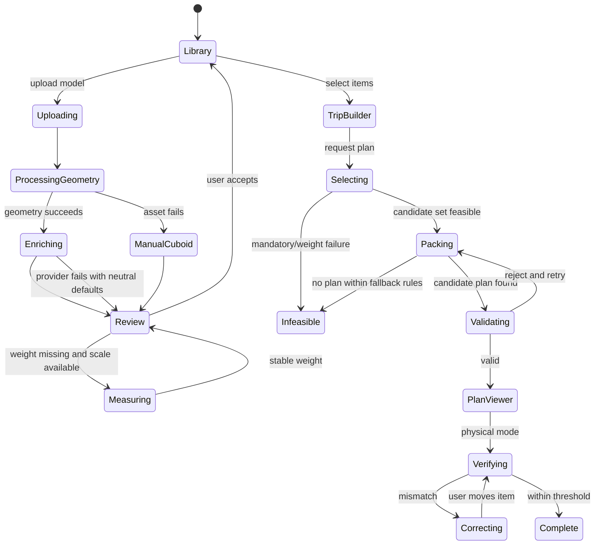

# PackRight: Software-First Full Build Guide

**Track:** Travelling  
**Build window:** under 24 hours  
**Team:** ECE + CS + Statistics/ML + related STEM  
**System boundary:** a 3D scan already exists before it enters PackRight  
**Core promise:** upload an item model, automatically derive and infer its packing metadata, select a trip and suitcase, generate a feasible packing plan, and optionally verify weight distribution on physical hardware

---

## 1. Product definition

### One-line pitch

**PackRight converts a library of scanned belongings into a priority-aware, physically feasible suitcase plan—and verifies that the real bag matches the plan.**

### Problem

Packing is not merely a volume problem. Travelers must simultaneously consider:

- internal suitcase dimensions;
- baggage weight limits;
- which objects are mandatory or expendable;
- fragile and crushable objects;
- allowable orientations;
- access during the journey;
- weight distribution;
- the difference between a digital plan and the bag actually packed.

Current workflows usually separate these concerns: a packing list knows item names, a luggage scale knows total weight, and a generic 3D packer knows dimensions. PackRight unifies them into one plan.

### Primary user journey

1. The user uploads a previously produced 3D model or chooses a stock/library item.
2. PackRight derives geometry automatically.
3. A multimodal model proposes handling metadata from rendered views.
4. Weight is imported, measured on a connected scale, or entered once.
5. The user confirms only trip-specific or safety-critical facts.
6. The user chooses items, suitcase dimensions, empty-suitcase weight, and baggage limit.
7. A deterministic optimizer selects and places items.
8. A 3D viewer presents a numbered packing sequence.
9. A physical scale or four-corner suitcase tray optionally verifies total weight and center of mass.
10. If the real pack differs from the plan, PackRight recommends a correction.

### Non-goals for the hackathon

- creating the 3D scan;
- photogrammetry or LiDAR reconstruction;
- arbitrary deformable-clothing simulation;
- millimeter-perfect irregular-mesh collision;
- airline-certified weighing;
- cloud accounts, social features, or a native mobile app;
- letting an LLM invent final packing coordinates;
- automatically packing the physical suitcase with a robot.

---

## 2. System architecture



### Design principle

The model produces **semantic suggestions**. Deterministic code produces and validates **physical feasibility**.

```text
Model: “This appears fragile and should remain upright.”
Solver: “This cuboid fits at x=120, y=0, z=240 without collision.”
Hardware: “The measured center of mass is 62 mm right of the plan.”
```

Never blur these responsibilities in the code or pitch.

---

## 3. Recommended technology stack

### Frontend

- React + TypeScript + Vite;
- Three.js directly or React Three Fiber for visualization;
- lightweight state management such as Zustand or React context;
- ordinary CSS or an existing component kit the team already knows;
- browser local storage only as an emergency persistence fallback.

Three.js provides an official `GLTFLoader` for glTF 2.0 assets. [Three.js GLTFLoader](https://threejs.org/docs/pages/GLTFLoader.html).

### Backend

- Python 3;
- FastAPI;
- Pydantic request/response schemas;
- SQLite;
- SQLAlchemy or direct SQLite access;
- local filesystem for uploaded assets;
- Trimesh for loading geometry and oriented bounds;
- OR-Tools for subset/knapsack selection;
- a custom 3D placement heuristic or a rapidly validated 3D packing library;
- provider adapter for Gemini/K2;
- `pyserial` for optional hardware.

Trimesh exposes oriented-bounding-box utilities and GLB loading, which makes it appropriate for the deterministic geometry stage. [Trimesh bounds](https://trimesh.org/trimesh.bounds.html), [Trimesh GLB loading](https://trimesh.org/trimesh.exchange.gltf.html).

### Deployment

- run the frontend and backend locally on one laptop;
- do not require a cloud database;
- cache AI enrichment responses;
- retain manual metadata entry if the model API fails;
- keep a preloaded demonstration database and asset directory.

### Suggested repository

```text
packright/
├── frontend/
│   ├── src/
│   │   ├── pages/
│   │   │   ├── LibraryPage.tsx
│   │   │   ├── ItemReviewPage.tsx
│   │   │   ├── TripBuilderPage.tsx
│   │   │   └── PackingPlanPage.tsx
│   │   ├── components/
│   │   │   ├── ItemCard.tsx
│   │   │   ├── ItemUploader.tsx
│   │   │   ├── MetadataReview.tsx
│   │   │   ├── SuitcaseForm.tsx
│   │   │   ├── PackingViewer.tsx
│   │   │   ├── PackingTimeline.tsx
│   │   │   └── HardwareStatus.tsx
│   │   ├── three/
│   │   │   ├── ItemModel.tsx
│   │   │   ├── SuitcaseScene.tsx
│   │   │   └── PlanAnimation.tsx
│   │   ├── api/client.ts
│   │   └── types.ts
│   └── public/
├── backend/
│   ├── main.py
│   ├── api/
│   │   ├── items.py
│   │   ├── trips.py
│   │   ├── plans.py
│   │   └── hardware.py
│   ├── models/
│   │   ├── item.py
│   │   ├── suitcase.py
│   │   ├── trip.py
│   │   └── plan.py
│   ├── services/
│   │   ├── asset_ingestion.py
│   │   ├── geometry.py
│   │   ├── renderer.py
│   │   ├── enrichment.py
│   │   ├── selection.py
│   │   ├── packing.py
│   │   ├── validation.py
│   │   ├── explanation.py
│   │   └── hardware_bridge.py
│   ├── providers/
│   │   ├── base.py
│   │   ├── gemini.py
│   │   └── k2.py
│   └── db.py
├── firmware/
│   └── packright_scale.ino
├── assets/
│   ├── stock-models/
│   └── demo-models/
├── config/
│   ├── stock-items.json
│   ├── demo-trip.json
│   └── model-schema.json
├── tests/
│   ├── test_geometry.py
│   ├── test_selection.py
│   ├── test_packing.py
│   └── test_validation.py
└── README.md
```

---

## 4. Canonical data model

### Item

```json
{
  "id": "item_042",
  "name": "Laptop",
  "category": "electronics",
  "source": "custom_scan",
  "asset_uri": "/assets/items/item_042/model.glb",
  "preview_uris": [
    "/assets/items/item_042/front.png",
    "/assets/items/item_042/side.png",
    "/assets/items/item_042/top.png"
  ],
  "geometry": {
    "units": "mm",
    "dimensions_mm": [305, 215, 18],
    "oriented_box_transform": [1, 0, 0, 0, 0, 1, 0, 0, 0, 0, 1, 0, 0, 0, 0, 1],
    "mesh_volume_mm3": 1180350,
    "bounding_volume_mm3": 1180350,
    "clearance_mm": 5,
    "candidate_orientations": ["xyz", "yxz"],
    "scale_confidence": 0.99
  },
  "physical": {
    "weight_g": 1420,
    "weight_source": "measured",
    "stack_class": "top_only",
    "compressibility": "none",
    "fragility": "high",
    "can_support_weight": false,
    "liquid_risk": false
  },
  "defaults": {
    "priority": 4,
    "access": "normal",
    "must_pack": false
  },
  "provenance": {
    "geometry": "derived",
    "physical_handling": "model_confirmed",
    "weight": "measured",
    "defaults": "user_confirmed"
  },
  "created_at": "2026-09-11T20:00:00Z"
}
```

### Trip item

Priority belongs to the trip, not permanently to the object. A coat may be mandatory for Pittsburgh in winter and unnecessary for Miami.

```json
{
  "item_id": "item_042",
  "quantity": 1,
  "priority": 5,
  "must_pack": true,
  "access": "normal",
  "override_orientations": null,
  "notes": "Work laptop"
}
```

### Suitcase profile

```json
{
  "id": "case_01",
  "name": "Blue carry-on",
  "inner_dimensions_mm": [350, 220, 520],
  "empty_weight_g": 2800,
  "total_weight_limit_g": 10000,
  "clearance_mm": 8,
  "wheel_side": "z_min",
  "target_com_normalized": [0.5, 0.38, 0.45],
  "excluded_volumes": []
}
```

Use internal usable dimensions, not marketing/exterior dimensions. In the MVP, model the receptacle as one cuboid. Wheel wells and tapered lids become optional excluded volumes.

### Packing placement

```json
{
  "item_id": "item_042",
  "instance": 0,
  "position_mm": [15, 0, 180],
  "orientation": "yxz",
  "placed_dimensions_mm": [215, 305, 18],
  "step": 2,
  "support_ratio": 1.0,
  "predicted_com_mm": [122, 9, 189]
}
```

### Packing plan

```json
{
  "id": "plan_101",
  "trip_id": "trip_12",
  "status": "feasible",
  "packed_item_ids": ["item_042", "item_006"],
  "excluded": [
    {
      "item_id": "item_018",
      "reason": "Lowest priority item required to meet the weight limit"
    }
  ],
  "placements": [],
  "metrics": {
    "packed_item_weight_g": 6900,
    "total_case_weight_g": 9700,
    "priority_retained": 0.94,
    "bounding_volume_utilization": 0.73,
    "predicted_com_mm": [174, 84, 225],
    "solver_runtime_ms": 840
  },
  "violations": []
}
```

---

## 5. Component 1: asset ingestion

### Responsibility

Accept a supplied 3D asset and create a safe, normalized processing job.

### Inputs

- `.glb`, preferred;
- optional `.gltf` with related buffers/textures;
- optional OBJ only as a stretch;
- optional user-entered display name;
- optional supplied weight and source;
- optional preview images from the external scanner.

glTF defines linear distances in meters and a standard coordinate system, making GLB the cleanest interchange format. [Khronos glTF 2.0 specification](https://registry.khronos.org/glTF/specs/2.0/glTF-2.0.html).

### Must contain

- multipart file upload;
- unique asset directory per item;
- file-type and size validation;
- safe generated filenames;
- GLB parser error handling;
- scene-transform application;
- unit normalization to millimeters;
- upper and lower dimension sanity bounds;
- processing status: `uploaded`, `processing`, `review`, `ready`, or `failed`;
- actionable errors instead of raw stack traces.

### Recommended validation

- maximum upload size: 25–50 MB;
- exactly one default scene or a deterministic scene merge;
- no dimension below 1 mm;
- no dimension above 2,000 mm without explicit confirmation;
- finite vertex coordinates;
- no NaN/Infinity transforms;
- generated preview even if material textures fail.

### Output

An item draft with asset URI, normalized units, ingestion warnings, and a geometry-processing task.

### Fallback

If parsing fails, let the user add a cuboid using length, width, and height while retaining the display model separately.

### Acceptance test

Upload five known GLBs with different node transforms. All produce dimensionally correct item drafts or clear recovery prompts.

---

## 6. Component 2: deterministic geometry processor

### Responsibility

Turn an arbitrary supplied scene into conservative geometry the packing solver can trust.

### Must calculate

- combined world-space vertex set after transforms;
- axis-aligned bounds;
- oriented bounding box;
- canonical dimensions;
- oriented-box transform;
- mesh or convex-hull volume when reliable;
- bounding-box volume;
- geometry-to-box fill ratio;
- candidate orthogonal orientations;
- suggested clearance padding;
- geometric center;
- preview camera framing.

### MVP representation

The packing engine uses an oriented cuboid even when the viewer renders the detailed mesh. This deliberately separates presentation fidelity from solver reliability.

### Candidate orientations

Represent the six axis-aligned permutations:

```text
xyz, xzy, yxz, yzx, zxy, zyx
```

The model later proposes which are semantically acceptable. The hard validator receives only the approved subset.

### Clearance

Start with:

```text
effective_dimension = measured_dimension + max(4 mm, 0.02 × measured_dimension)
```

Expose one suitcase-level “packing tolerance” setting. Do not let every item have a complicated tolerance form.

### Handling imperfect meshes

- Non-watertight: skip physical mesh volume and use box volume.
- Multiple disconnected components: merge for bounds but retain warning.
- Extreme triangle count: simplify only for rendering; bounds can use the original vertices.
- Incorrect scale: ask the user to confirm one known dimension.
- Empty/corrupt geometry: fall back to manual cuboid.

### Output

Normalized `geometry` object plus warnings and three or four canonical preview renders.

### Acceptance test

For a known 300 × 200 × 100 mm test cuboid rotated inside the GLB, the oriented dimensions must recover the same three extents within rounding tolerance.

---

## 7. Component 3: multi-view renderer

### Responsibility

Generate consistent images for metadata enrichment and provide an immediate user preview.

### Must contain

- neutral background;
- normalized lighting;
- front, side, top, and perspective views;
- object centered and fitted to frame;
- no dimensions baked into the image unless also supplied as text;
- cached PNG or WebP outputs;
- fallback material if textures are absent.

### Why render views

The multimodal model should not need to parse a proprietary 3D file. Give it stable 2D views plus exact deterministic measurements. Gemini officially supports multiple-image prompting and image classification, but its own guidance notes that model outputs may be inaccurate and should be post-processed and evaluated. [Gemini image understanding](https://ai.google.dev/gemini-api/docs/image-understanding).

### Implementation choices

- browser-side Three.js screenshots;
- server-side Blender render, only if Blender is already installed;
- server-side Trimesh/Pyrender, only if known to work on the machine.

Choose one path in hour one. Do not spend the event installing a fragile headless renderer.

### Fallback

Ask the user to upload one normal item photograph or provide the item name. Geometry processing remains unaffected.

### Acceptance test

Every demo item produces at least three nonblank, correctly framed images within five seconds.

---

## 8. Component 4: model-assisted metadata enrichment

### Responsibility

Autofill semantic packing metadata so the user reviews a card rather than completes a form.

### Inputs

- item display name, if supplied;
- 3–4 rendered views;
- exact dimensions and box fill ratio;
- optional scanner description;
- trip context only when generating trip-specific defaults.

### Model output schema

```json
{
  "name": "Wireless headphones case",
  "category": "electronics",
  "fragility": "medium",
  "compressibility": "none",
  "stack_class": "top_only",
  "can_support_weight": false,
  "liquid_risk": false,
  "allowed_orientations": ["xyz", "xzy", "yxz", "yzx", "zxy", "zyx"],
  "suggested_access": "quick",
  "suggested_priority": 4,
  "suggested_must_pack": false,
  "short_reason": "Electronic accessory likely needed during travel and unsuitable for heavy top loading.",
  "needs_confirmation": ["priority", "must_pack"],
  "confidence": {
    "category": 0.96,
    "fragility": 0.76,
    "compressibility": 0.91,
    "stack_class": 0.72,
    "orientations": 0.65
  }
}
```

### Required enums

```text
fragility: low | medium | high
compressibility: none | light | high
stack_class: base | neutral | top_only
access: buried_ok | normal | quick
orientation: xyz | xzy | yxz | yzx | zxy | zyx
```

### Prompt requirements

The system prompt must instruct the model to:

- use only the supplied views and measurements;
- return exactly the schema;
- never invent weight or dimensions;
- propose conservative handling;
- distinguish default priority from `must_pack`;
- add ambiguous or high-impact properties to `needs_confirmation`;
- avoid claiming certainty about hidden contents;
- keep the reason under one sentence.

Gemini’s structured-output mode supports schema-constrained JSON and is appropriate for this step. [Gemini structured outputs](https://ai.google.dev/gemini-api/docs/structured-output).

### Confirmation policy

Always require confirmation for:

- `must_pack`;
- trip-specific priority;
- liquid status for container-like objects;
- orientation restrictions that could cause leakage or damage;
- any field below the chosen confidence threshold;
- any model inference conflicting with stock metadata.

Confidence is not proof. Treat it as a routing hint, not a calibrated safety guarantee.

### Gemini versus K2

- **Gemini:** best fit when using item render images directly.
- **K2:** suitable when enrichment is based on supplied item descriptions and structured geometry or when pursuing the IFM prize.
- **Provider abstraction:** keep the same internal schema so the team can switch providers without changing the UI or optimizer.

### Fallback

Populate neutral defaults and show four compact controls: name, stack class, allowed orientations, and special handling. Weight and priority remain separate.

### Acceptance test

Ten diverse demo items all produce schema-valid responses. Invalid outputs are rejected, retried once, then routed to manual review without blocking the application.

---

## 9. Component 5: weight acquisition

### Responsibility

Obtain the one important physical property a visual model cannot reliably infer.

### Input hierarchy

1. measured by connected scale;
2. supplied by external scanning pipeline;
3. trusted stock-item personal record;
4. manually entered by user;
5. missing—never guessed by the model.

### Minimal hardware option

- one 5–20 kg four-wire load cell;
- one HX711 or NAU7802 ADC;
- ESP32/Arduino;
- rigid weighing platform;
- tare/check-in button;
- USB serial connection.

### Serial event

```json
{"event":"stable_weight","weight_g":1423,"stddev_g":4.1,"source":"scale"}
```

### UI behavior

- New item shows “Place item on scale.”
- Wait for stable measurement.
- Fill the weight automatically.
- Let the user accept or remeasure.
- Store measurement timestamp and source.

### No-hardware fallback

One numeric field with unit selector and remembered preferred unit.

### Acceptance test

Five repeated measurements of a demo item fall within the team’s measured tolerance, and the UI cannot silently save a zero or missing weight as valid.

---

## 10. Component 6: item review and confirmation

### Responsibility

Convert the system-generated draft into a trusted library item with minimal user effort.

### Default card

```text
Laptop
30.5 × 21.5 × 1.8 cm · 1.42 kg
Suggested: ★★★★☆ · top layer · flat only · not compressible

[Accept]  [Change priority]  [Special handling]
```

### Must contain

- 3D preview;
- dimensions and weight with provenance;
- model-proposed category and handling summary;
- one-tap acceptance;
- explicit `must_pack` control;
- 1–5 priority control;
- expandable advanced fields;
- warnings for missing weight, suspect scale, or uncertain handling;
- rescan/reupload action;
- delete action with confirmation.

### Per-item user burden targets

| Item type | Expected interaction |
|---|---|
| Saved library item | Select only; 1–2 seconds |
| Stock template | Select and confirm personal weight if needed; 2–5 seconds |
| New scan with supplied weight | Upload, review, accept; 5–10 seconds |
| New scan using connected scale | Upload, place on scale, accept; 8–15 seconds |
| Ambiguous/safety-sensitive item | Answer one focused question; 10–20 seconds |

### Acceptance test

A new user can add a known item without opening advanced fields, and every solver-required field is valid after acceptance.

---

## 11. Component 7: item library

### Responsibility

Store reusable personal items and stock templates separately.

### Must contain

- grid/list of item cards;
- search by name/category;
- filter by personal versus stock;
- preview thumbnail;
- weight and dimensions;
- provenance marker: measured, derived, inferred, confirmed;
- duplicate-as-personal action for stock templates;
- edit and delete;
- multi-select for trip creation;
- missing-data indicator;
- local persistence.

### Stock-item strategy

Seed only 12–20 visually distinct templates:

- laptop;
- laptop charger;
- phone charger;
- toiletry bag;
- folded shirt block;
- shoes;
- jacket;
- medication pouch;
- book;
- headphones;
- water bottle;
- camera;
- camera lens;
- travel adapter;
- towel.

Stock values are templates, not universal truth. Label weights and dimensions as example values until the user confirms or measures their personal instance.

### Database rule

Never mutate the global stock template when a user edits it. Clone it into a personal item.

### Acceptance test

A user can create a trip from six stored items in under 20 seconds.

---

## 12. Component 8: trip builder

### Responsibility

Collect trip context once, suggest trip-specific priorities, and select the packing candidate set.

### Trip fields

- trip name;
- destination, optional;
- duration;
- activities/free-text purpose;
- weather summary, optional;
- transport type;
- carry-on versus checked;
- laundry availability, optional;
- suitcase profile;
- baggage weight limit;
- selected library items.

### Bulk model assistance

Send the trip context plus compact item summaries to the model and request:

- suggested priority per item;
- suggested `must_pack` candidates;
- access level;
- one short reason;
- uncertainty/confirmation flags.

The user reviews all suggestions on one screen. Do not make a separate model request for every item at trip time.

### Required interaction

- stars are editable inline;
- `must_pack` is a separate toggle;
- total candidate weight is visible;
- mandatory-item infeasibility is warned before packing;
- missing geometry/weight blocks planning with a clear reason;
- “Accept suggestions” is available, but mandatory flags remain visually prominent.

### Acceptance test

Changing the trip from “three-day conference” to “weekend hiking” can produce different suggested priorities without altering the saved item defaults.

---

## 13. Component 9: suitcase/receptacle profiles

### Responsibility

Represent the container and its hard limits.

### Required fields

- internal width, height, and depth;
- unit;
- empty suitcase weight;
- total baggage weight limit;
- packing clearance;
- wheel side or preferred heavy side;
- name/preset.

### Derived values

```text
usable_item_weight = total_weight_limit − empty_suitcase_weight
usable_volume = product(inner_dimensions − clearance)
```

### Optional stretch fields

- lid versus base compartment;
- divider plane;
- wheel-well exclusion boxes;
- irregular internal mesh;
- compression allowance;
- separate compartment limits.

### Must contain

- numeric validation;
- dimension diagram with labeled axes;
- stock carry-on preset clearly marked as an example;
- impossible/negative usable-weight warning;
- persistent saved profiles;
- manual “rotate suitcase” control if axes were entered incorrectly.

### Acceptance test

A judge can alter one dimension or the weight limit and trigger a visibly different plan.

---

## 14. Component 10: selection optimizer

### Responsibility

Choose which nonmandatory items should remain when all candidates do not fit by weight or approximate capacity.

### Hard constraints

- every `must_pack` item is included;
- packed item weight plus empty suitcase weight does not exceed the limit;
- individually oversized objects are rejected;
- quantity is honored;
- missing weight or geometry cannot silently pass.

### Objective

```text
maximize
    Σ packed_i × priority_value_i
  + must_pack_bonus
  + category_coverage_bonus
  − number_of_excluded_items_penalty
  − approximate_volume_excess_penalty
```

The exact 3D placement stage decides spatial feasibility. The selection stage quickly removes obviously infeasible low-value candidates.

### Priority mapping

Use a nonlinear mapping so a five-star item matters substantially more than a one-star item:

```text
1 star → value 1
2 stars → value 3
3 stars → value 7
4 stars → value 15
5 stars → value 31
```

Mandatory remains a hard constraint, not a very large score.

### Implementation

OR-Tools provides a Python knapsack solver and general constraint solvers suitable for this selection stage. [OR-Tools knapsack](https://developers.google.com/optimization/pack/knapsack), [OR-Tools overview](https://developers.google.com/optimization/).

For fewer than 20 items, exhaustive subset enumeration with pruning is also acceptable and may be easier to customize.

### Output

- selected instances;
- excluded instances;
- exclusion reason;
- retained priority percentage;
- weight and approximate volume totals;
- infeasibility explanation when mandatory items cannot fit.

### Baseline

Compare against “remove the heaviest nonmandatory item first.” Demonstrate that PackRight retains greater user priority at the same weight.

### Acceptance test

Given the fixed demo trip, the optimizer preserves medication and laptop while removing lower-priority shoes after the weight limit is reduced.

---

## 15. Component 11: 3D placement optimizer

### Responsibility

Place the selected cuboids inside the suitcase without overlap while optimizing space, handling, accessibility, and balance.

### Coordinate convention

```text
x: suitcase width, left to right
y: vertical height, bottom to top
z: suitcase depth/length, wheel side to hinge side
origin: lower-left wheel-side interior corner
```

### Hard constraints

- every placement lies within usable suitcase bounds;
- no two effective bounding boxes overlap;
- placement uses an approved orientation;
- support ratio exceeds the configured threshold for elevated objects;
- `top_only` items do not support heavier items;
- mandatory items are present;
- total weight remains legal.

### Soft objectives

- high bounding-volume utilization;
- heavy objects low and near the chosen target region;
- center of mass near the target;
- fragile/top-only items high;
- quick-access items near the opening/top;
- fewer inaccessible cavities;
- fewer rotations and simpler instructions;
- higher-priority objects preferred if spatial replanning requires exclusions.

### Weekend-safe algorithm

Use an extreme-point heuristic with limited beam search:

1. Sort items by mandatory status, stack class, weight, volume, and priority.
2. Initialize candidate point `(0,0,0)`.
3. For each item, try every approved orientation at every candidate point.
4. Reject collision, out-of-bounds, and support violations.
5. Score feasible placements.
6. Retain the best `K` partial plans, such as 20–50.
7. Add candidate points at the placed box’s positive x, y, and z faces.
8. Remove dominated or inaccessible candidate points.
9. Repeat with several item orderings within a strict time budget.
10. Pass the best result to the independent validator.

### Placement score

```text
score =
    + priority_retained
    + volume_utilization
    + support_quality
    − center_of_mass_distance
    − fragile_load_penalty
    − access_penalty
    − void_fragmentation
    − instruction_complexity
```

### Support check

For any item above the floor, calculate the portion of its bottom face supported by top faces below it. Require approximately 70–80% for the MVP. Enforce 100% floor support for `base` objects if easiest.

### Center of mass

Approximate each item’s mass at the center of its placed box:

```text
c_total = Σ(weight_i × center_i) / Σ weight_i
```

This is an approximation because the true mass distribution inside an object may be uneven. Store a local center-of-mass offset only as a future extension.

### Time limit

Return the best valid plan found within 1–3 seconds. A fast good plan creates a better demo than an exact solver that occasionally stalls.

### Fallback

If the 3D heuristic fails:

1. retry with fewer orientations/pruned items;
2. remove the lowest-value nonmandatory item;
3. rerun;
4. if mandatory items still fail, return a truthful infeasible result.

### Acceptance test

Twenty fixed test scenarios all return either a validator-approved plan or a clear infeasible result within the time limit.

---

## 16. Component 12: hard plan validator

### Responsibility

Independently verify the solver result. The UI must never render an invalid plan as successful.

### Checks

- all coordinates finite;
- item count and identity correct;
- approved orientations only;
- bounds with clearance;
- pairwise non-overlap;
- weight limit;
- mandatory item inclusion;
- support threshold;
- stack-class rules;
- exclusion volumes;
- calculated metrics consistent with placements.

### Output

```json
{
  "valid": false,
  "violations": [
    {
      "type": "collision",
      "items": ["item_12", "item_18"],
      "overlap_mm": [8, 12, 3]
    }
  ]
}
```

### Rule

The validator shares data structures but not placement decision code with the optimizer. Otherwise the same bug may create and approve an invalid plan.

### Acceptance test

Feed deliberately corrupted plans containing overlap, overflow, invalid rotation, missing mandatory item, and excess weight. Every one must fail with the correct reason.

---

## 17. Component 13: explanation and instruction generator

### Responsibility

Turn a validated plan into short, actionable packing steps.

### Deterministic explanation first

Generate facts from solver output:

- item excluded and binding constraint;
- why a placement is low/high/front/back;
- current cumulative weight;
- next numbered packing step;
- expected center-of-mass change.

Example:

```text
1. Place shoes flat against the wheel-side base.
2. Place the laptop flat above the shoes; do not stack heavy objects on it.
3. Place medication in the top-front access zone.

Excluded: hardcover book. Removing it was the lowest-priority way to meet the 10 kg limit.
```

### Optional model rewrite

The model may rewrite these verified facts into friendlier language, but it may not add placements, exclusions, or constraints. Validate item IDs in the generated response.

### Acceptance test

Every step refers to a real placement and uses consistent orientation language.

---

## 18. Component 14: 3D packing viewer

### Responsibility

Make the plan understandable within seconds and guide the physical packing order.

### Must contain

- translucent suitcase walls;
- actual uploaded meshes when available;
- cuboid fallback for every item;
- color/texture keyed to stack class, paired with labels;
- orbit and zoom controls;
- reset-camera button;
- packing-order stepper;
- current-step item emphasis;
- show/hide already packed items;
- item label on selection;
- weight and priority in the item detail;
- center-of-mass marker;
- target center-of-mass marker;
- excluded-item list with reasons;
- plan metrics;
- responsive layout.

### Avoid

- continuous spinning;
- physics simulation;
- dozens of unlabeled colors;
- photorealistic suitcase materials;
- particle effects;
- allowing the user to drag items into invalid states unless an edit mode is deliberately built.

### Packing animation

Animate one item entering at a time when advancing the sequence. Do not autoplay during the judge explanation; the presenter controls the step.

### Acceptance test

A person unfamiliar with the project can identify the first three items and their intended locations without verbal explanation.

---

## 19. Component 15: physical verification hardware

This component is strongly recommended because the judges explicitly value technical difficulty and physical integration.

### Minimum hardware: smart registration scale

- automatically fills weight for new items;
- reduces data-entry burden;
- gives the ECE member a meaningful component;
- creates a live upload → weigh → enrich moment.

### Winning hardware: four-corner verification tray

- four independent load cells;
- four independent HX711 channels;
- ESP32;
- addressable LEDs around 4–6 zones;
- USB serial;
- tare/reset control.

Do not use a four-sensor combinator with one HX711 if center-of-mass measurement is required; that configuration intentionally produces one summed weight reading. [SparkFun HX711/load-cell guide](https://learn.sparkfun.com/tutorials/load-cell-amplifier-hx711-breakout-hookup-guide/all).

### Telemetry

```json
{
  "t_ms": 43120,
  "forces_g": [820, 910, 630, 740],
  "total_g": 3100,
  "com_mm": [184, 241],
  "stable": true
}
```

### Verification behavior

Compare:

- expected total weight versus measured;
- expected planar center of mass versus measured;
- expected placement zone versus the current imbalance.

If deviation exceeds the tested threshold:

```text
Plan target: 174 mm from left
Measured: 231 mm from left
Correction: move Bottle from right zone to left-center zone
```

### LED feedback

- amber pulse: item/current region to change;
- green inward sweep: target region;
- green perimeter: verified;
- red/white corner: sensor fault;
- blue slow pulse: tare required.

### Acceptance test

Intentionally place one heavy block in the wrong half. The system detects the direction of error, recommends the correct move, and verifies improvement after the move.

---

## 20. Component 16: frontend pages

### A. Library page

Contains:

- personal/stock toggle;
- search;
- compact item grid;
- multi-select;
- add/upload button;
- completeness warnings;
- create-trip action.

### B. New-item review page

Contains:

- 3D preview;
- enrichment progress;
- weight acquisition panel;
- generated metadata card;
- Accept, Change priority, and Special handling actions;
- provenance labels;
- only unresolved questions expanded by default.

### C. Trip builder page

Contains:

- trip context;
- suitcase selector/editor;
- selected-item list;
- total requested weight;
- bulk priority suggestions;
- inline priority and must-pack controls;
- feasibility warnings;
- Pack button.

### D. Packing plan page

Contains:

- dominant 3D viewer;
- numbered step controls;
- current instruction;
- packed/excluded tabs;
- plan metrics;
- replan controls for limit or suitcase change;
- hardware verification status.

### E. Engineering/debug view

Contains:

- raw model response;
- geometry bounds;
- solver log;
- validation report;
- hardware channels;
- reset demo action.

Hide this from the normal user and open it only for technical judge questions.

---

## 21. Component 17: backend API

### Item endpoints

```text
POST   /api/items/upload
GET    /api/items
GET    /api/items/{id}
PATCH  /api/items/{id}
DELETE /api/items/{id}
POST   /api/items/{id}/enrich
POST   /api/items/{id}/remeasure
POST   /api/items/{id}/confirm
```

### Suitcase endpoints

```text
POST   /api/suitcases
GET    /api/suitcases
PATCH  /api/suitcases/{id}
DELETE /api/suitcases/{id}
```

### Trip endpoints

```text
POST   /api/trips
GET    /api/trips/{id}
PATCH  /api/trips/{id}
POST   /api/trips/{id}/suggest-priorities
```

### Plan endpoints

```text
POST   /api/plans
GET    /api/plans/{id}
POST   /api/plans/{id}/validate
POST   /api/plans/{id}/replan
```

### Hardware endpoints

```text
GET       /api/hardware/status
POST      /api/hardware/tare
WebSocket /api/hardware/telemetry
```

### API rules

- return typed errors with user-facing messages;
- never block indefinitely on AI or optimization;
- set strict timeouts;
- persist draft state before external API calls;
- cache enrichment by asset hash and prompt/schema version;
- validate model data before database writes;
- validate packing plans before returning success.

---

## 22. Component 18: persistence and stock data

### SQLite tables

```text
items
item_assets
item_metadata_versions
suitcases
trips
trip_items
packing_plans
placements
model_runs
hardware_sessions
```

### Minimum stored provenance

- source of dimensions;
- source of weight;
- model/provider and schema version;
- whether a person confirmed the field;
- optimizer version;
- validator version;
- plan seed/time limit;
- timestamps.

### Stock data requirements

Every stock template must include:

- generic name and category;
- default handling classes;
- example geometry or model;
- example weight if available;
- `requires_personal_confirmation: true` for variable values;
- source note or “illustrative estimate” label.

### Acceptance test

Restart the application and reproduce the same demo plan from stored items without invoking the model again.

---

## 23. Component 19: observability and evaluation

### Log each stage

- upload and asset hash;
- geometry-processing duration and warnings;
- model latency and schema validity;
- user corrections to model metadata;
- selection runtime and objective;
- packing runtime and attempts;
- validator result;
- hardware measured versus predicted state.

### Model metrics

- schema-valid response rate;
- percentage of suggested fields accepted unchanged;
- average confirmations required per item;
- average item-onboarding time;
- fallback rate.

### Optimizer metrics

- feasible-plan rate on test set;
- runtime;
- bounding-volume utilization;
- priority retained;
- baggage-limit compliance;
- center-of-mass distance from target;
- validator rejection count.

### Hardware metrics

- weight error;
- center-of-mass error;
- correct error-direction detection;
- time to stable measurement;
- successful demo-cycle rate.

### Judge-facing metrics

Show at most four:

1. metadata fields automatically completed;
2. onboarding time per new item;
3. priority retained versus naive baseline;
4. predicted-versus-measured balance error.

Use only measured hackathon results.

---

## 24. End-to-end state machine



---

## 25. 24-hour build schedule

### Hour 0–1: freeze contracts

- Agree on the item, suitcase, and placement JSON schemas.
- Confirm one GLB loads in frontend and backend.
- Test the selected model endpoint once.
- Test one load cell if hardware is included.
- Select a fixed six-item demo.

**Gate:** every team member can show the exact input/output of their subsystem.

### Hours 1–5: parallel foundations

**CS:** FastAPI, SQLite, upload endpoint, item CRUD.  
**Statistics/ML:** selection and placement prototypes using hard-coded cuboids.  
**ECE:** registration scale or four-corner sensor telemetry.  
**STEM/frontend:** page skeleton, suitcase/item visuals, demo assets.

**Gate:** hard-coded items produce a valid textual placement plan; one real item weight reaches the backend.

### Hours 5–9: geometry and library

- normalize GLB;
- calculate bounds;
- generate or accept preview images;
- complete item review and library pages;
- load stock items;
- complete geometry tests.

**Gate:** upload → dimensions → saved item works without AI.

### Hours 9–13: enrichment and optimizer

- schema-constrained model response;
- validation/fallback;
- trip builder;
- selection solver;
- 3D heuristic;
- hard plan validator.

**Gate:** six selected items produce a validated plan; changing the limit changes exclusions.

### Hours 13–17: viewer and integration

- render suitcase and placed models/cuboids;
- packing sequence;
- exclusion reasons;
- model metadata card;
- hardware verification or registration flow.

**Gate:** complete user journey works once without developer intervention.

### Hours 17–20: reliability

- run fixed test suite;
- handle corrupt asset/model timeout/infeasible plan;
- cache demo enrichment;
- simplify slow or unreliable interactions;
- capture real metrics.

**Gate:** nine of ten demo runs succeed.

### Hours 20–22: physical and visual polish

- consistent item models/labels;
- clean scale or suitcase tray;
- purposeful LEDs;
- loading/error states;
- remove debug clutter;
- create backup video.

### Hours 22–24: feature freeze

- rehearse under 2:45;
- prepare judge questions;
- verify offline/local assets;
- duplicate database and calibration;
- no new features.

---

## 26. Team ownership

### ECE

- weight acquisition hardware;
- four-corner verification if included;
- firmware, filtering, calibration, and serial protocol;
- physical suitcase/scale presentation;
- hardware reliability and safety.

### CS

- backend API and persistence;
- upload pipeline;
- frontend/backend integration;
- Three.js viewer integration;
- deployment and recovery.

### Statistics/ML

- model schema and evaluation;
- priority suggestion design;
- knapsack selection;
- 3D placement heuristic and scoring;
- plan validator tests and baselines.

### Related STEM

- frontend flow and UI polish;
- stock/demo item assets;
- trip/suitcase domain assumptions;
- usability tests;
- demo production and metrics collection;
- support on geometry or fabrication according to specialty.

Pair CS and Statistics/ML on the common data schema. Pair ECE and frontend on the scale/check-in interaction. The interface should never wait for one person’s undocumented output format.

---

## 27. Demo plan

### Demo setup

- six preloaded items and matching physical blocks;
- one new supplied GLB with a matching physical object;
- one suitcase preset;
- connected registration scale;
- optional four-corner verification tray;
- cached model responses plus a live enrichment path;
- a reset button restoring the known database state.

### Exact three-minute sequence

#### 0:00–0:20 — Problem

“Packing apps know lists, scales know weight, and 3D packers know dimensions. None understands what matters to the traveler and then verifies the real bag.”

#### 0:20–0:50 — New item with minimal entry

Upload the supplied 3D model. Geometry appears automatically. Show multiple rendered views and derived dimensions. Put the matching item on the scale; weight fills automatically. The model proposes “electronics, top-only, noncompressible, quick access.” Press **Accept**.

#### 0:50–1:15 — Build the trip

Select six items and the carry-on preset. The model suggests trip-specific priorities. Confirm medicine and laptop as mandatory.

#### 1:15–1:42 — Judge changes constraint

Let a judge reduce the weight limit or suitcase depth. Click **Pack**. The deterministic optimizer excludes a low-priority item and produces a validated arrangement.

#### 1:42–2:15 — 3D packing reveal

Advance through the first three packing steps. Point out heavy objects at the wheel-side base, fragile electronics above them, and medication near the opening.

#### 2:15–2:42 — Physical verification

Place a heavy physical block on the wrong side. The verification tray shows the predicted/measured mismatch and lights the target region. Move it; the measured center approaches the plan and the border turns green.

#### 2:42–3:00 — Evidence and close

Show automatic-field percentage, solver time, priority retained versus baseline, and measured balance error.

“PackRight does not ask AI to imagine a packing plan. AI removes data entry, optimization guarantees feasibility, and hardware verifies reality.”

---

## 28. Risk register and cut order

| Risk | Early test | Mitigation | Cut line |
|---|---|---|---|
| GLB transforms produce wrong scale | known cuboid upload in hour one | normalize scene; dimension confirmation | manual cuboid fallback |
| Headless rendering fails | render one preview immediately | render in browser or accept scanner previews | item name plus geometry only |
| Model returns bad metadata | ten-item schema test | strict validation, one retry, neutral defaults | manual four-field review |
| 3D solver cannot pack common case | six-cuboid prototype by hour five | beam search, fewer orientations, remove low-priority item | 2.5D layer packing |
| Viewer consumes too much time | render cuboids first | meshes are cosmetic replacements | retain cuboids only |
| Weight hardware drifts | five-repeat measurement | tare, median filter, rigid mount | manual weight field |
| Four-corner tray slips | corner-press test | rigid platform, independent channels | registration scale only |
| Stock data looks inaccurate | compare template/personal states | label examples; require confirmation | reduce stock library |
| API/internet fails | disconnect test | cached demo plus manual metadata | no live AI call |
| Demo exceeds three minutes | timed rehearsal at hour 20 | preload trip and scan | live only one upload and one replan |

### Cut order

1. irregular-mesh collision;
2. OBJ support;
3. model-written explanations;
4. K2/Gemini provider switching;
5. stock catalog beyond 12 items;
6. multiple suitcases;
7. continuous camera input;
8. four-corner hardware, retaining the registration scale;
9. uploaded mesh rendering, retaining cuboids;

Do not cut the hard validator, priority/must-pack distinction, or visible constraint change. Those define the product.

---

## 29. Definition of done

### Required

- [ ] Upload one valid GLB.
- [ ] Derive correct normalized dimensions.
- [ ] Render at least one usable preview.
- [ ] Produce schema-valid model metadata or a graceful fallback.
- [ ] Obtain or enter a nonzero weight.
- [ ] Confirm priority separately from `must_pack`.
- [ ] Save and reload the item.
- [ ] Select at least six items for a trip.
- [ ] Enter/select suitcase dimensions and weight limit.
- [ ] Produce a plan within three seconds.
- [ ] Validate bounds, collision, weight, orientation, and mandatory inclusion.
- [ ] Display exclusions with reasons.
- [ ] Render a numbered 3D packing sequence.
- [ ] Replan after a judge changes one constraint.
- [ ] Complete ten repeated demo runs with at least nine successes.

### Strongly recommended

- [ ] Connected scale automatically fills item weight.
- [ ] Four-corner tray compares planned and measured balance.
- [ ] Physical LEDs guide one correction.
- [ ] Model suggestions reduce average onboarding to under 15 seconds.
- [ ] PackRight retains more priority than a heaviest-first baseline.

### Stretch

- [ ] Exclusion volumes for wheel wells.
- [ ] Uploaded meshes replace cuboids in the final view.
- [ ] Multiple suitcase profiles.
- [ ] NFC association between physical and digital items.
- [ ] Accessibility-focused guidance mode.

---

## 30. Submission language

### Short pitch

“PackRight turns pre-scanned belongings into a priority-aware suitcase plan. It derives geometry from each 3D asset, uses a multimodal model to autofill handling metadata, measures or imports weight, and asks the traveler only to confirm subjective constraints. A deterministic optimizer guarantees bounds, orientation, collision, and weight compliance. An instrumented suitcase can then verify the physical result.”

### Track relevance

“PackRight improves a universal travel task: deciding what to bring and how to fit it safely within baggage constraints. Travelers select reusable scanned belongings, declare what matters, and receive a validated packing sequence optimized for weight, space, fragility, access, and balance. Physical sensing can verify that the real suitcase matches the plan.”

### Technical thesis

**AI interprets. Optimization decides. Hardware verifies.**

---

## 31. Primary references

- [Khronos glTF 2.0 specification](https://registry.khronos.org/glTF/specs/2.0/glTF-2.0.html): coordinate system and meter-based linear units.
- [Three.js GLTFLoader](https://threejs.org/docs/pages/GLTFLoader.html): browser loading of glTF 2.0 assets.
- [Trimesh oriented bounds](https://trimesh.org/trimesh.bounds.html): oriented-bounding-box computation.
- [Trimesh GLB loading](https://trimesh.org/trimesh.exchange.gltf.html): GLB scene ingestion.
- [Gemini image understanding](https://ai.google.dev/gemini-api/docs/image-understanding): multiple image inputs and image classification capabilities, with model-output caveats.
- [Gemini structured outputs](https://ai.google.dev/gemini-api/docs/structured-output): schema-constrained JSON output.
- [OR-Tools knapsack](https://developers.google.com/optimization/pack/knapsack): priority/capacity subset selection.
- [OR-Tools overview](https://developers.google.com/optimization/): general optimization and constraint-solving tools.
- [SparkFun HX711 guide](https://learn.sparkfun.com/tutorials/load-cell-amplifier-hx711-breakout-hookup-guide/all): load-cell acquisition and four-sensor combinator behavior.
