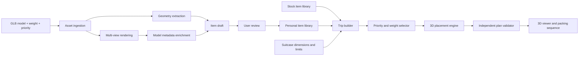

# PackRight: Software-Only Build Guide

**Track:** Travelling  
**Build window:** under 24 hours  
**Team:** ECE + CS + Statistics/ML + related STEM  
**External assumption:** 3D scanning occurs outside PackRight  
**Required user inputs per custom item:** 3D model, weight, and priority  
**Core promise:** convert a reusable library of scanned belongings into a priority-aware, validated 3D suitcase plan

This guide supersedes the earlier hardware-integrated PackRight plans.

---

## 1. Final product definition

### Pitch

**PackRight accepts pre-scanned belongings, automatically extracts geometry and infers handling constraints, then computes a feasible packing sequence for a user-defined suitcase while preserving the traveler’s highest-priority items.**

### Required user journey

1. Upload a pre-existing 3D model.
2. Enter the item’s weight.
3. Select its priority from one to five stars.
4. PackRight extracts dimensions and generates preview renders.
5. A multimodal model suggests the item name, category, fragility, compressibility, stack class, and legal orientations.
6. The user reviews one generated summary card and accepts or edits it.
7. The item is saved in a reusable library.
8. The user selects custom and stock items for a trip.
9. The user enters the suitcase’s internal dimensions, empty weight, and baggage limit.
10. PackRight selects what can fit and generates a validated 3D placement plan.
11. The interface presents excluded items, packing metrics, and a numbered packing sequence.
12. Changing the suitcase or limit triggers a visible replan.

### Required custom-item inputs

Only three fields are mandatory:

| Input | User action | Why it cannot be omitted |
|---|---|---|
| 3D model | Upload `.glb` | Supplies geometry and visual representation |
| Weight | Enter a number and unit | Required for baggage limits and weight-distribution scoring |
| Priority | Select 1–5 stars | Encodes the traveler’s subjective value |

Everything else is derived, inferred, defaulted, or optional.

### Non-goals

- generating the 3D scan;
- measuring physical weight;
- hardware sensing or verification;
- accounts, social sharing, or multi-device synchronization;
- deformable-fabric simulation;
- exact irregular-mesh contact physics;
- allowing a language model to generate packing coordinates;
- airline certification or guaranteed real-world fit.

---

## 2. System architecture



### Responsibility split

```text
Deterministic geometry code:
    dimensions, bounds, volume proxy, candidate rotations

Multimodal model:
    item semantics and proposed handling constraints

User:
    weight, priority, and confirmation of unusual handling

Optimization engine:
    item selection and placement coordinates

Validator:
    proof that the returned plan obeys encoded constraints
```

The project should be described as **model-assisted data entry plus deterministic packing**, not an “AI auto-packer.”

---

## 3. Recommended stack

### Frontend

- React;
- TypeScript;
- Vite;
- Three.js or React Three Fiber;
- Zustand or React context;
- ordinary CSS or a familiar component library;
- local browser storage as an emergency fallback.

### Backend

- Python 3;
- FastAPI;
- Pydantic;
- SQLite;
- SQLAlchemy or direct SQLite;
- Trimesh for GLB ingestion and oriented bounds;
- OR-Tools or custom enumeration for item selection;
- custom extreme-point/beam-search 3D packing heuristic;
- Gemini provider adapter;
- optional K2 provider adapter for text-based semantic reasoning.

### Local deployment

- frontend and backend on one laptop;
- uploaded assets stored in a local project directory;
- no authentication;
- no cloud database;
- model calls cached by asset hash;
- demo can continue with cached metadata if internet fails.

### Repository layout

```text
packright/
├── frontend/
│   ├── src/
│   │   ├── pages/
│   │   │   ├── LibraryPage.tsx
│   │   │   ├── NewItemPage.tsx
│   │   │   ├── TripBuilderPage.tsx
│   │   │   └── PlanPage.tsx
│   │   ├── components/
│   │   │   ├── ModelUploader.tsx
│   │   │   ├── RequiredItemInputs.tsx
│   │   │   ├── MetadataReview.tsx
│   │   │   ├── ItemCard.tsx
│   │   │   ├── SuitcaseForm.tsx
│   │   │   ├── PackingViewer.tsx
│   │   │   ├── PackingStepper.tsx
│   │   │   └── PlanMetrics.tsx
│   │   ├── three/
│   │   │   ├── ItemScene.tsx
│   │   │   ├── SuitcaseScene.tsx
│   │   │   └── PackingAnimation.tsx
│   │   ├── api/client.ts
│   │   └── types.ts
│   └── public/
├── backend/
│   ├── main.py
│   ├── api/
│   │   ├── items.py
│   │   ├── suitcases.py
│   │   ├── trips.py
│   │   └── plans.py
│   ├── services/
│   │   ├── ingestion.py
│   │   ├── geometry.py
│   │   ├── rendering.py
│   │   ├── enrichment.py
│   │   ├── selection.py
│   │   ├── placement.py
│   │   ├── validation.py
│   │   └── explanation.py
│   ├── providers/
│   │   ├── base.py
│   │   ├── gemini.py
│   │   └── k2.py
│   ├── schemas/
│   │   ├── item.py
│   │   ├── suitcase.py
│   │   ├── trip.py
│   │   └── plan.py
│   └── db.py
├── assets/
│   ├── stock/
│   ├── uploads/
│   └── demo/
├── config/
│   ├── stock-items.json
│   ├── enrichment-schema.json
│   └── demo-trip.json
├── tests/
│   ├── test_ingestion.py
│   ├── test_geometry.py
│   ├── test_selection.py
│   ├── test_placement.py
│   └── test_validation.py
└── README.md
```

---

## 4. Canonical item model

```json
{
  "id": "item_042",
  "name": "Laptop",
  "category": "electronics",
  "source": "custom",
  "asset_uri": "/assets/uploads/item_042/model.glb",
  "preview_uris": [
    "/assets/uploads/item_042/front.png",
    "/assets/uploads/item_042/side.png",
    "/assets/uploads/item_042/top.png"
  ],
  "user_inputs": {
    "weight_g": 1420,
    "priority": 5
  },
  "geometry": {
    "units": "mm",
    "dimensions_mm": [305, 215, 18],
    "oriented_box_transform": [1, 0, 0, 0, 0, 1, 0, 0, 0, 0, 1, 0, 0, 0, 0, 1],
    "mesh_volume_mm3": 1180350,
    "bounding_volume_mm3": 1180350,
    "clearance_mm": 5,
    "candidate_orientations": ["xyz", "yxz"],
    "scale_confidence": 0.99
  },
  "handling": {
    "fragility": "high",
    "compressibility": "none",
    "stack_class": "top_only",
    "can_support_weight": false,
    "liquid_risk": false,
    "access": "normal",
    "allowed_orientations": ["xyz", "yxz"]
  },
  "provenance": {
    "asset": "user",
    "weight": "user",
    "priority": "user",
    "geometry": "derived",
    "handling": "model_confirmed"
  },
  "created_at": "2026-09-11T20:00:00Z"
}
```

### Required versus optional fields

| Field | Required | Source |
|---|---|---|
| GLB asset | Yes | User |
| Weight | Yes | User |
| Priority | Yes | User |
| Dimensions | Yes | Derived from asset |
| Allowed orientations | Yes | Model suggestion plus default |
| Stack class | Yes | Model suggestion plus default |
| Fragility | Recommended | Model suggestion |
| Compressibility | Recommended | Model suggestion |
| Access | Optional | Model suggestion or user edit |
| Must-pack | Optional trip-level override | User |
| Liquid risk | Optional confirmation | Model suggestion and user |
| Name/category | Recommended | Model suggestion |

### Priority semantics

```text
1 star: easiest to omit
2 stars: optional
3 stars: useful
4 stars: important
5 stars: highest-value item
```

A five-star item is still not a hard constraint. Add an optional `must_pack` toggle in the trip builder for true necessities. Keeping this separate prevents impossible plans from being disguised by scoring.

---

## 5. Suitcase model

```json
{
  "id": "case_01",
  "name": "Blue carry-on",
  "inner_dimensions_mm": [350, 220, 520],
  "empty_weight_g": 2800,
  "total_weight_limit_g": 10000,
  "clearance_mm": 8,
  "wheel_side": "z_min",
  "target_com_normalized": [0.5, 0.38, 0.45],
  "excluded_volumes": []
}
```

### Required user inputs

- internal width;
- internal height;
- internal depth;
- empty suitcase weight;
- maximum total baggage weight.

### Derived values

```text
available_item_weight = total_weight_limit − empty_weight
usable_dimensions = internal_dimensions − clearance
usable_volume = product(usable_dimensions)
```

### Optional stretch

- wheel-well exclusion boxes;
- divider plane;
- lid and base compartments;
- tapered interior;
- saved suitcase presets.

The MVP treats the suitcase as one rectangular cuboid.

---

## 6. Component 1: item creation form

### Purpose

Collect the three user inputs with the minimum possible friction.

### Must contain

- drag-and-drop GLB upload;
- file picker fallback;
- weight numeric field;
- grams, kilograms, ounces, and pounds selector;
- one-to-five star priority control;
- upload progress;
- inline validation;
- Create Item button;
- clear statement that additional metadata will be generated automatically.

### Validation

- `.glb` only for MVP;
- file size below 25–50 MB;
- weight greater than zero and below a configurable sanity limit;
- priority is an integer from one to five;
- normalized storage weight in grams;
- units displayed back to the user in their chosen system;
- duplicate upload warning based on file hash.

### Do not ask here

- dimensions;
- category;
- fragility;
- compression ratio;
- orientation rules;
- stackability;
- access order;
- free-form description.

Those would undermine the autofill experience.

### Acceptance test

A first-time user can submit a valid item with one file selection, one weight entry, and one priority click.

---

## 7. Component 2: asset ingestion

### Purpose

Safely store and normalize the supplied 3D model.

### Must contain

- generated item ID and asset directory;
- secure filename handling;
- content/type check;
- size limit;
- asset hash;
- GLB parser error handling;
- scene transform application;
- coordinate and unit normalization;
- processing status;
- actionable error response.

### GLB rules

glTF specifies a right-handed coordinate system and meters for linear distances. Convert final world-space coordinates to millimeters internally. [Khronos glTF specification](https://registry.khronos.org/glTF/specs/2.0/glTF-2.0.html).

### Error recovery

If parsing fails:

- keep the entered weight and priority in a draft;
- explain why the asset failed;
- allow replacement upload;
- do not silently create a fake cuboid from arbitrary defaults.

### Acceptance test

Five GLBs with nested transforms either produce correctly normalized scenes or a clear error without crashing the server.

---

## 8. Component 3: geometry extraction

### Purpose

Produce conservative geometric constraints from the supplied model.

### Must calculate

- combined world-space vertices;
- axis-aligned bounding box;
- oriented bounding box;
- canonical dimensions;
- bounding-box transform;
- bounding-box volume;
- mesh or convex-hull volume when reliable;
- geometric center;
- box-fill ratio;
- six orthogonal orientation candidates;
- preview-camera distance;
- processing warnings.

Trimesh provides GLB loading and oriented-bounds utilities appropriate for this component. [Trimesh GLB loading](https://trimesh.org/trimesh.exchange.gltf.html), [Trimesh oriented bounds](https://trimesh.org/trimesh.bounds.html).

### Packing representation

Use the oriented bounding box for collision and placement. Render the detailed mesh inside that box for presentation.

This avoids spending the event on irregular-mesh collision while preserving the visual value of the supplied scan.

### Clearance

Start with:

```text
clearance = max(4 mm, 2% of the corresponding dimension)
effective_dimension = derived_dimension + clearance
```

Make suitcase-level clearance adjustable from 0–15 mm in the engineering settings.

### Fault handling

- non-watertight mesh: use box volume;
- disconnected components: merge for bounds and store warning;
- extreme polygon count: retain for bounds and simplify only for display;
- dimensions outside plausible range: require scale confirmation;
- no vertices: fail item creation;
- transform contains NaN/Infinity: fail item creation.

### Acceptance test

A rotated 300 × 200 × 100 mm reference cuboid is recovered as the same three oriented dimensions within rounding tolerance.

---

## 9. Component 4: multi-view rendering

### Purpose

Create consistent images the multimodal model can understand and the item library can display.

### Required renders

- front;
- side;
- top;
- three-quarter perspective.

### Must contain

- neutral background;
- normalized lighting;
- centered object;
- consistent scale within the frame;
- fallback material when textures are missing;
- cached PNG/WebP files;
- thumbnail;
- render failure fallback.

### Implementation options

1. Browser Three.js screenshots, recommended if the frontend already loads the model.
2. Server-side renderer only if already available and tested.
3. External scanner preview images if supplied.

Three.js has an official glTF loader for browser rendering. [Three.js GLTFLoader](https://threejs.org/docs/pages/GLTFLoader.html).

### Acceptance test

Every demo item produces at least three nonblank, correctly framed views.

---

## 10. Component 5: model metadata enrichment

### Purpose

Fill the semantic fields the 3D model does not contain, reducing item creation to review rather than data entry.

### Inputs

- four rendered views;
- exact derived dimensions;
- box-fill ratio;
- user-entered weight;
- user-entered priority;
- optional asset filename.

Weight and priority are context, not values the model may modify.

### Output schema

```json
{
  "name": "Wireless headphones case",
  "category": "electronics",
  "fragility": "medium",
  "compressibility": "none",
  "stack_class": "top_only",
  "can_support_weight": false,
  "liquid_risk": false,
  "allowed_orientations": ["xyz", "xzy", "yxz", "yzx", "zxy", "zyx"],
  "access": "quick",
  "short_reason": "A rigid electronics case that should remain accessible and should not bear heavy loads.",
  "needs_confirmation": [],
  "confidence": {
    "name": 0.92,
    "category": 0.97,
    "fragility": 0.76,
    "compressibility": 0.88,
    "stack_class": 0.72,
    "orientations": 0.65,
    "access": 0.58
  }
}
```

### Enums

```text
fragility: low | medium | high
compressibility: none | light | high
stack_class: base | neutral | top_only
access: buried_ok | normal | quick
orientation: xyz | xzy | yxz | yzx | zxy | zyx
```

### System prompt requirements

The prompt must instruct the model to:

- return only the schema;
- use the supplied views and geometry;
- never change or estimate weight;
- never change or estimate personal priority;
- never produce packing coordinates;
- infer conservatively;
- flag hidden-content ambiguity;
- flag liquid-container ambiguity;
- restrict orientations only when visually justified;
- keep the reason under one sentence.

Gemini supports multi-image input and schema-constrained structured output. [Gemini image understanding](https://ai.google.dev/gemini-api/docs/image-understanding), [Gemini structured output](https://ai.google.dev/gemini-api/docs/structured-output).

### Provider decision

- Use Gemini when item images are the main signal.
- Use K2 only if the system receives a useful text description or if the IFM prize is strategically more important.
- Do not build provider switching until one complete provider works.

### Validation

- reject unknown enum values;
- remove duplicate orientations;
- intersect suggested orientations with geometric candidates;
- require at least one orientation;
- clamp confidence to 0–1;
- limit name and reason length;
- preserve user weight and priority regardless of response;
- retry invalid JSON once;
- fall back to neutral metadata.

### Neutral fallback

```json
{
  "name": "Unnamed item",
  "category": "other",
  "fragility": "medium",
  "compressibility": "none",
  "stack_class": "neutral",
  "can_support_weight": false,
  "liquid_risk": false,
  "allowed_orientations": ["xyz", "xzy", "yxz", "yzx", "zxy", "zyx"],
  "access": "normal",
  "needs_confirmation": ["name", "handling"]
}
```

### Acceptance test

Ten varied objects produce schema-valid metadata or the neutral fallback without blocking item creation.

---

## 11. Component 6: item review

### Purpose

Let the user confirm the model’s work without presenting a large form.

### Default view

```text
Laptop
30.5 × 21.5 × 1.8 cm · 1.42 kg · ★★★★★
High fragility · top layer · flat orientations · normal access

[Accept item]  [Edit handling]
```

### Must contain

- interactive 3D preview;
- four derived dimensions/weight/priority summary values;
- generated name and category;
- one-line handling summary;
- provenance: user, derived, or model;
- highlighted confirmation questions only when necessary;
- Accept item button;
- Edit handling drawer;
- Replace model button;
- edit weight and priority controls;
- delete draft.

### Advanced drawer

- name;
- category;
- fragility;
- compressibility;
- stack class;
- allowed orientations;
- access;
- liquid risk.

### Target user effort

- file selection;
- one weight entry;
- one star selection;
- one acceptance click.

Expected normal onboarding time after processing: **10–20 seconds**, excluding upload/model latency.

### Acceptance test

A user can save an ordinary item without opening advanced settings, while an ambiguous bottle asks one focused confirmation question.

---

## 12. Component 7: item library

### Purpose

Store reusable custom items and stock templates.

### Must contain

- Custom and Stock tabs;
- search;
- category filter;
- card/list view;
- thumbnail;
- dimensions;
- weight;
- priority;
- handling summary;
- completeness state;
- edit/delete custom item;
- duplicate stock item into personal library;
- multi-select;
- Start packing action.

### Stock catalog

Seed 12–20 visually distinct items:

- laptop;
- laptop charger;
- phone charger;
- toiletry bag;
- folded shirt;
- pair of shoes;
- jacket;
- medication pouch;
- book;
- headphones;
- water bottle;
- camera;
- camera lens;
- travel adapter;
- towel.

### Stock-item rule

Stock items may contain example dimensions, weight, priority, and handling. Mark them as templates. When selected, let the user accept the defaults or clone/edit them. Never imply that every laptop or pair of shoes has the same measurements.

### Acceptance test

A user can select six mixed stock/custom items and begin suitcase configuration in under 20 seconds.

---

## 13. Component 8: trip builder

### Purpose

Assemble selected items and optional hard overrides for one packing run.

### Must contain

- selected items;
- quantity;
- editable priority;
- optional `must_pack` toggle;
- total requested item weight;
- total priority score;
- suitcase profile selector;
- Create suitcase action;
- obvious missing-data errors;
- Pack button.

### Why priority remains editable

The saved star rating is a default. The traveler may change it for a particular trip without editing the permanent library item.

### Must-pack behavior

`must_pack` is optional and trip-specific. The selection optimizer may never remove a mandatory item. If mandatory items cannot fit, return an infeasible result rather than weakening the constraint.

### Acceptance test

Changing one item from two to five stars changes the exclusion decision in the fixed test scenario.

---

## 14. Component 9: suitcase editor

### Purpose

Collect the packing volume and weight capacity.

### Must contain

- internal width, height, and depth;
- unit selection;
- empty suitcase weight;
- total baggage limit;
- optional wheel-side selector;
- optional packing clearance;
- save preset;
- small labeled dimension diagram;
- impossible-value validation.

### Rules

- use interior dimensions;
- convert to millimeters and grams;
- item weight capacity equals total limit minus empty weight;
- reject nonpositive available capacity;
- warn when one selected item exceeds a container dimension in every orientation.

### Acceptance test

Reducing one suitcase dimension makes at least one known plan reorient or become infeasible.

---

## 15. Component 10: item selection optimizer

### Purpose

Choose the highest-value subset when all requested items cannot fit by weight or approximate capacity.

### Priority mapping

Use nonlinear utility:

```text
1 star → 1
2 stars → 3
3 stars → 7
4 stars → 15
5 stars → 31
```

### Hard constraints

- mandatory items included;
- total item weight within available item-weight capacity;
- individually oversized items excluded or marked infeasible;
- quantity honored;
- all selected records have weight and geometry.

### Objective

```text
maximize
    packed priority utility
  − excluded item count penalty
  − approximate volume excess penalty
  + optional category coverage
```

### Implementation options

1. Exhaustive subsets with pruning for fewer than 20 instances.
2. OR-Tools knapsack/multidimensional knapsack.
3. CP-SAT only if more custom constraints are necessary.

OR-Tools documents knapsack and general constraint optimization directly. [OR-Tools knapsack](https://developers.google.com/optimization/pack/knapsack), [OR-Tools overview](https://developers.google.com/optimization/).

### Output

- candidate packed set;
- preliminary exclusions;
- weight retained;
- priority retained;
- exclusion rationale;
- infeasible mandatory set if applicable.

### Baselines

- remove heaviest first;
- remove lowest-star first without spatial reasoning.

### Acceptance test

The demo case preserves five-star laptop and medication while excluding lower-value objects under a reduced weight limit.

---

## 16. Component 11: 3D placement engine

### Purpose

Produce item coordinates and orientations satisfying hard geometry constraints.

### Coordinate system

```text
x: left to right
y: bottom to top
z: wheel side to hinge/opening side
origin: lower-left wheel-side corner
```

### Hard constraints

- within usable suitcase bounds;
- pairwise non-overlap of effective bounding boxes;
- approved orientation;
- mandatory inclusion;
- total-weight compliance;
- minimum support for elevated boxes;
- no heavy load above a `top_only` object.

### Soft objectives

- priority retained;
- bounding-volume utilization;
- low/heavy items toward the base and wheel side;
- center of mass near target;
- fragile objects high;
- quick-access objects near the top/opening;
- simple packing sequence;
- fewer fragmented voids.

### Recommended heuristic

Use extreme points plus beam search:

1. Sort by mandatory, stack class, weight, volume, and priority.
2. Start with candidate point `(0,0,0)`.
3. Try each approved orientation at each candidate point.
4. Reject bounds, collision, and support failures.
5. Score feasible placements.
6. Retain the best 20–50 partial states.
7. Add candidate points at positive box faces.
8. Remove dominated points.
9. Repeat with several item orderings.
10. Stop after 1–3 seconds and validate the best result.

### Center of mass

Approximate each object’s mass at its placed-box center:

```text
c_total = Σ(weight_i × box_center_i) / Σ weight_i
```

This is a planning approximation, not a measured physical center of mass.

### Support

Require 70–80% overlap between an elevated item’s bottom face and supported surfaces beneath it. Use stricter rules for `base` objects and prohibit support loading on `top_only` objects.

### Failure recovery

1. Retry item ordering.
2. Retry with fewer permitted orientations only if required for stability.
3. Remove the lowest-utility nonmandatory item.
4. Rerun.
5. Return infeasible if mandatory items still cannot fit.

### Acceptance test

Twenty fixed scenarios return either a valid plan or a truthful infeasible result in under three seconds.

---

## 17. Component 12: independent validator

### Purpose

Prevent the application from displaying an invalid plan as successful.

### Must check

- finite coordinates;
- correct item count and identity;
- approved orientation;
- bounds plus clearance;
- pairwise non-overlap;
- mandatory inclusion;
- weight limit;
- support threshold;
- stack-class rules;
- metrics recomputed from placements.

### Output

```json
{
  "valid": false,
  "violations": [
    {
      "type": "collision",
      "items": ["item_12", "item_18"],
      "overlap_mm": [8, 12, 3]
    }
  ]
}
```

### Architecture rule

The validator may reuse schemas and geometry primitives, but it should not simply call the optimizer’s own “is valid” method. Independent checks are the defense against shared logic bugs.

### Acceptance test

Deliberately corrupt plans with overlap, overflow, illegal orientation, missing mandatory item, and excess weight. Every plan must fail for the expected reason.

---

## 18. Component 13: plan explanation

### Purpose

Explain what was packed, what was excluded, and why.

### Deterministic content

- selected and excluded items;
- binding weight or spatial constraint;
- priority retained;
- packing order;
- orientation label;
- relative location;
- fragile/stack/access rationale;
- center-of-mass score.

### Example

```text
1. Place shoes flat against the wheel-side base.
2. Place the toiletry bag beside the shoes.
3. Place the laptop flat above the base layer; do not load heavy items on it.
4. Place medication near the opening for quick access.

Excluded: hardcover book. It was the lowest-priority removal needed to satisfy the weight limit and produce a feasible arrangement.
```

### Optional model role

A model may rewrite validated facts into concise prose. It may not add items, coordinates, rotations, or explanations unsupported by solver output.

### Acceptance test

Every instruction references an actual placement and uses consistent location/orientation terminology.

---

## 19. Component 14: 3D packing viewer

### Purpose

Make the solution understandable and impressive within seconds.

### Must contain

- translucent suitcase volume;
- actual supplied item meshes when performant;
- colored cuboid fallback;
- orbit/zoom;
- reset camera;
- numbered stepper;
- current item emphasis;
- show/hide packed layers;
- selected-item label;
- weight and priority;
- orientation indicator;
- predicted center-of-mass marker;
- target marker;
- excluded-items panel;
- plan metrics;
- replan controls.

### Visual rules

- use consistent category/handling colors plus text labels;
- do not animate continuously;
- make actual meshes optional so one bad asset cannot crash the plan;
- highlight bounding boxes only in engineering mode;
- animate one item entering when the presenter advances the step;
- keep the suitcase dominant over metrics panels.

### Wow features that remain software-only

- render the supplied scans rather than generic boxes;
- provide an x-ray mode showing packed layers;
- show weight-distribution heat across the suitcase floor;
- animate center of mass moving as each item is packed;
- switch between “heaviest-first baseline” and optimized plan;
- let a judge change one suitcase dimension and watch the plan reorganize;
- show the validator’s green constraint checklist after planning.

### Acceptance test

A new viewer can identify the first three items and their destinations without a verbal explanation.

---

## 20. Component 15: library and plan persistence

### Tables

```text
items
item_assets
item_geometry
item_handling_versions
stock_items
suitcases
trips
trip_items
packing_plans
placements
model_runs
```

### Must store

- original asset path and hash;
- normalized dimensions;
- user weight and priority;
- model provider, model ID, prompt version, and response;
- user corrections;
- suitcase and trip inputs;
- selection result;
- placement coordinates;
- validator result;
- optimizer seed and runtime;
- creation/update timestamps.

### Cache key

```text
asset_hash + geometry_version + enrichment_prompt_version + provider_model
```

Weight or priority changes should not require another image-enrichment call unless those fields materially affect the prompt.

### Acceptance test

Restart the application and reproduce the saved demo plan without invoking the model again.

---

## 21. Component 16: backend API

### Items

```text
POST   /api/items
POST   /api/items/{id}/asset
POST   /api/items/{id}/process
POST   /api/items/{id}/enrich
POST   /api/items/{id}/confirm
GET    /api/items
GET    /api/items/{id}
PATCH  /api/items/{id}
DELETE /api/items/{id}
```

### Suitcases

```text
POST   /api/suitcases
GET    /api/suitcases
GET    /api/suitcases/{id}
PATCH  /api/suitcases/{id}
DELETE /api/suitcases/{id}
```

### Trips

```text
POST   /api/trips
GET    /api/trips/{id}
PATCH  /api/trips/{id}
POST   /api/trips/{id}/items
```

### Plans

```text
POST   /api/plans
GET    /api/plans/{id}
POST   /api/plans/{id}/validate
POST   /api/plans/{id}/replan
```

### API behavior

- typed request and response schemas;
- stage-specific status and progress;
- strict upload, AI, and solver timeouts;
- no raw exception text in user responses;
- drafts saved before model calls;
- model output validated before persistence;
- plan validated before `status: feasible`;
- stable IDs for items and placements;
- deterministic demo mode with known seed.

---

## 22. Frontend pages

### A. Library

- Custom/Stock tabs;
- search and category filter;
- item cards with thumbnail, weight, stars, and dimensions;
- multi-select;
- New item;
- Start packing.

### B. New item

- GLB dropzone;
- weight and unit;
- star priority;
- processing progress;
- model preview;
- generated metadata review;
- Accept/Edit handling.

### C. Trip builder

- selected item list;
- quantity;
- priority overrides;
- optional must-pack toggles;
- total requested weight;
- suitcase selector/editor;
- feasibility warnings;
- Pack.

### D. Plan

- dominant 3D viewer;
- step controls;
- current instruction;
- excluded-item reasons;
- utilization, weight, priority retained, and center-of-mass metrics;
- constraint-validation status;
- suitcase/limit quick edit;
- Replan.

### E. Engineering view

- raw geometry;
- model response;
- item effective boxes;
- solver attempts;
- objective breakdown;
- validator details;
- demo reset.

Keep the engineering view hidden during the normal demo and use it for technical questions.

---

## 23. Evaluation

### Metadata metrics

- schema-valid enrichment rate;
- handling fields accepted unchanged;
- average manual corrections per item;
- average item onboarding time;
- enrichment latency;
- cached-response rate.

### Packing metrics

- feasible-plan rate;
- solver runtime;
- validator rejection count;
- bounding-volume utilization;
- total weight and remaining allowance;
- priority retained;
- center-of-mass distance from target;
- number of excluded items;
- average support ratio.

### Baselines

1. Heaviest-first removal.
2. Lowest-star-first removal without spatial feasibility.
3. First-fit-decreasing packing using volume only.

### Judge-facing metrics

Show at most four:

- item onboarding time;
- model metadata acceptance rate;
- priority retained versus baseline;
- plan utilization and runtime.

Use measured results only.

---

## 24. 24-hour implementation plan

### Hour 0–1

- freeze schemas;
- load one GLB in Three.js;
- load the same GLB in Trimesh;
- test one Gemini structured-output call;
- select six demo assets and one suitcase.

**Gate:** one asset produces a preview and dimensions.

### Hours 1–5

**CS:** backend, SQLite, item upload and CRUD.  
**Statistics/ML:** hard-coded selection and packing engine.  
**ECE:** geometry processing, transform/unit tests, validator.  
**STEM/frontend:** page shell, item form, library, demo assets.

**Gate:** hard-coded boxes generate a validator-approved textual plan.

### Hours 5–9

- upload form with weight and stars;
- geometry extraction;
- preview renderer;
- item library;
- stock items;
- suitcase form.

**Gate:** user can upload, input weight/priority, and save an item without AI.

### Hours 9–13

- model enrichment;
- schema validation and fallback;
- trip builder;
- item selection;
- 3D placement;
- independent validator.

**Gate:** six items produce a validated plan and exclusions.

### Hours 13–17

- Three.js packing viewer;
- step-by-step animation;
- explanations;
- center-of-mass visualization;
- replan after changed limit/dimension.

**Gate:** full demo path works once without source-code edits.

### Hours 17–20

- fixed test set;
- corrupt asset and failed model handling;
- infeasible plan handling;
- metrics;
- cache enrichment;
- performance tuning.

**Gate:** nine of ten demo runs succeed.

### Hours 20–22

- visual polish;
- stock-item consistency;
- clean loading states;
- baseline comparison;
- backup video.

### Hours 22–24

- feature freeze;
- timed rehearsal;
- duplicate demo database;
- local asset check;
- no new features.

---

## 25. Team ownership

### ECE

With no hardware component, give the ECE member technical ownership of:

- coordinate systems and unit normalization;
- geometric transforms;
- oriented bounds;
- support and stability rules;
- independent validator;
- center-of-mass modeling.

### CS

- backend and database;
- upload pipeline;
- frontend/backend integration;
- Three.js viewer;
- deployment and recovery.

### Statistics/ML

- enrichment schema and prompt;
- model-output evaluation;
- item-selection optimization;
- 3D placement heuristic;
- baselines and metrics.

### Related STEM

- frontend flow and design;
- stock/demo asset preparation;
- domain assumptions;
- usability tests;
- test cases;
- pitch and live-demo direction.

Pair ECE and Statistics/ML on the validator and placement objective. Pair CS and frontend on one complete upload-to-plan flow.

---

## 26. Three-minute demo

### Setup

- five saved personal/stock items;
- one new GLB ready for upload;
- one saved suitcase;
- cached model responses and a working live path;
- one-click demo reset;
- fixed baseline result.

### 0:00–0:18 — Problem

“Packing lists know item names, and 3D packers know dimensions. Neither knows what matters most to a traveler while respecting weight, fragility, access, and balance.”

### 0:18–0:52 — New item

Upload one supplied scan, type its weight, and select its stars. PackRight extracts dimensions, renders the item, and proposes handling metadata. Press **Accept**.

### 0:52–1:15 — Assemble trip

Select the new item plus five stock/library items. Choose the carry-on preset and mark medication mandatory.

### 1:15–1:42 — Judge-controlled constraint

Let a judge reduce the weight limit or suitcase depth. Click **Pack**. Show that a low-priority item is excluded while high-priority and mandatory items remain.

### 1:42–2:20 — Packing reveal

Animate the first three steps. Show heavy/base objects, fragile top-only objects, quick-access placement, and center-of-mass movement.

### 2:20–2:42 — Proof

Open the validator summary:

```text
Bounds ✓  Collision ✓  Weight ✓  Orientation ✓  Support ✓  Mandatory items ✓
```

Compare priority retained against heaviest-first or volume-only packing.

### 2:42–3:00 — Close

“The model removes metadata entry; it does not invent geometry. Every coordinate comes from a deterministic optimizer and every plan passes an independent physical-constraint validator.”

---

## 27. Software-only wow strategy

Because there is no hardware, polish and inspectability carry more weight.

### Essential wow moments

- upload an actual scanned model live;
- derived dimensions appear without user entry;
- model handling metadata arrives as a concise card;
- judge changes one suitcase dimension or limit;
- the 3D arrangement visibly reorganizes;
- actual scanned meshes animate into the suitcase;
- x-ray/layer mode makes hidden placements understandable;
- center-of-mass marker moves during packing;
- validator proves the plan rather than merely asserting success;
- optimized plan beats a visible baseline.

### Avoid

- chat interface;
- long model-generated descriptions;
- generic dashboards;
- waiting silently for inference;
- photorealistic polish that hides invalid packing;
- claiming simulated center of mass equals physical measurement;
- describing the model as the packing algorithm.

---

## 28. Risk register and cuts

| Risk | Test | Mitigation | Cut |
|---|---|---|---|
| Wrong GLB scale | known cuboid in hour one | normalize transforms and units | require scale confirmation |
| Model enrichment unreliable | ten-item schema test | validation, retry, neutral fallback | manual handling drawer |
| Server-side render fails | render first model immediately | browser screenshots | use scanner thumbnail/name |
| 3D heuristic cannot place normal set | hard-coded six-box case by hour five | beam search and item removal | layer-based 2.5D packing |
| Mesh viewer is slow | measure frame rate | use simplified mesh or cuboid | cuboids only |
| Plan looks valid but overlaps | validator corruption tests | independent validator | never cut validator |
| Stock data misleads | label provenance | template cloning/confirmation | reduce catalog |
| Internet/API fails | disconnect test | cached responses and neutral defaults | no live enrichment |
| Demo too long | rehearsal | preload library/suitcase | live only one upload and replan |

### Cut order

1. K2/Gemini provider switching;
2. mesh simplification;
3. server-side rendering;
4. model-written explanations;
5. stock catalog beyond 12 items;
6. multiple suitcase compartments;
7. irregular-mesh collision;
8. actual meshes in final plan, retaining boxes;
9. model enrichment, retaining manual neutral defaults.

Never cut the validator, weight/priority inputs, replan interaction, or clear exclusion rationale.

---

## 29. Definition of done

### Required

- [ ] Upload a GLB.
- [ ] Enter weight and priority.
- [ ] Derive normalized dimensions.
- [ ] Render a preview.
- [ ] Produce valid semantic metadata or fallback.
- [ ] Review and save the item.
- [ ] Browse custom and stock libraries.
- [ ] Select at least six items.
- [ ] Enter a suitcase and weight limit.
- [ ] Preserve optional mandatory items.
- [ ] Select a high-priority candidate set.
- [ ] Produce a 3D plan within three seconds.
- [ ] Validate collision, bounds, orientation, support, and weight.
- [ ] Explain exclusions.
- [ ] Show a numbered packing sequence.
- [ ] Replan after a judge changes one constraint.
- [ ] Complete nine of ten rehearsed runs.

### Strong additions

- [ ] Render actual item meshes in the final plan.
- [ ] Show x-ray/layer mode.
- [ ] Animate center-of-mass progression.
- [ ] Beat two simple baselines.
- [ ] Onboard a new item in under 20 seconds excluding latency.
- [ ] Cache enrichment for offline demo recovery.

### Stretch

- [ ] wheel-well exclusions;
- [ ] two suitcase compartments;
- [ ] multiple suitcase optimization;
- [ ] user-adjustable placement followed by revalidation;
- [ ] model-assisted trip-level access suggestions.

---

## 30. Submission wording

### Short pitch

“PackRight transforms pre-scanned belongings into a validated suitcase plan. Users provide only the item model, weight, and personal priority. PackRight derives geometry, uses a multimodal model to infer handling constraints, and asks for a quick confirmation. A deterministic optimizer then selects and arranges items while enforcing bounds, collision, weight, orientation, support, fragility, access, and balance.”

### Track relevance

“PackRight improves a universal travel task: choosing what to bring and fitting it within real baggage constraints. It combines reusable digital belongings, personal priority, suitcase dimensions, weight limits, fragility, access, and balance to create a validated packing sequence. Travelers can instantly replan when their baggage allowance or available suitcase changes.”

### Technical thesis

**The user supplies identity-level truth. The model supplies semantics. The optimizer supplies feasibility.**

---

## 31. References

- [Khronos glTF 2.0 specification](https://registry.khronos.org/glTF/specs/2.0/glTF-2.0.html)
- [Three.js GLTFLoader](https://threejs.org/docs/pages/GLTFLoader.html)
- [Trimesh oriented bounds](https://trimesh.org/trimesh.bounds.html)
- [Trimesh GLB loading](https://trimesh.org/trimesh.exchange.gltf.html)
- [Gemini image understanding](https://ai.google.dev/gemini-api/docs/image-understanding)
- [Gemini structured output](https://ai.google.dev/gemini-api/docs/structured-output)
- [OR-Tools knapsack documentation](https://developers.google.com/optimization/pack/knapsack)
- [OR-Tools overview](https://developers.google.com/optimization/)
