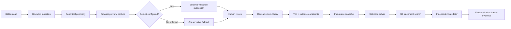

# PackRight

### Turn a pile of travel items into a validated, interactive 3D suitcase plan.


PackRight is an AI-assisted, constraint-aware packing planner built for HackCMU. Upload 3D models of the things you want to bring, enter the usable dimensions and weight limit of your suitcase, and PackRight generates a packing arrangement you can inspect one item at a time in a real 3D scene.

The key distinction is that PackRight does not stop at producing an attractive visualization. Every successful arrangement passes a separate deterministic validator that rechecks suitcase bounds, collisions, support, legal orientation, packing order, mandatory items, and total weight before the app labels it **feasible**.

> PackRight answers three practical questions: **What fits? Where does it go? In what order should I pack it?**

## Why PackRight

Packing advice is usually qualitative: roll clothes, put heavy items near the wheels, and hope everything fits. Traditional bin-packing demos go to the other extreme—they optimize anonymous boxes without understanding that a camera is fragile, medication should remain accessible, or a bottle must stay upright.

PackRight connects those two worlds:

- **Real geometry in:** validated GLB uploads are converted into canonical, millimeter-based item dimensions.
- **Human constraints preserved:** weight, priority, must-pack status, fragility, stackability, access preference, and legal orientations all affect the result.
- **AI where it helps:** Gemini can suggest semantic handling metadata from standardized item views, while deterministic code remains responsible for geometry and feasibility.
- **A usable answer out:** the result is an explorable suitcase model, numbered packing instructions, exclusions with reasons, and engineering diagnostics.

## The judge experience

1. Open the **Library** and choose several stock items or upload a custom `.glb` model.
2. Review the generated front, side, top, and three-quarter views and confirm the item's handling metadata.
3. Create a trip, set quantities and priorities, and mark anything that must be packed.
4. Enter the suitcase's internal width, height, depth, empty weight, and baggage limit.
5. Press **Pack these items**.
6. Step through the validated arrangement in 3D, orbit the suitcase, toggle x-ray mode, inspect support and orientation, and view the approximate center of mass.
7. Change the suitcase dimensions and replan without losing the previous result.

A completed plan has a durable URL, so refreshing the page or reopening it later reconstructs the same immutable planning snapshot.

## What makes the project technically distinctive

### 1. Geometry is measured, not guessed

The ingestion pipeline validates the GLB container, checks references and accessors, applies every scene-node transform—including repeated mesh instances—and computes world-space bounds in an isolated worker. The geometry stage derives a conservative oriented bounding box, a canonical transform, six proper rotations, volume estimates, and review warnings. GLB meters are converted to internal millimeters exactly once.

### 2. AI suggestions cannot overrule physical truth

When configured, Gemini receives four standardized previews, canonical dimensions, fill ratio, and the optional source filename. It can suggest a name, category, fragility, compressibility, stack class, legal orientations, and access preference. It never determines item dimensions, changes weight or trip priority, or decides whether a plan is valid.

Responses are constrained by a JSON schema, normalized, retried once if malformed, versioned, and cached. If the provider is unavailable or no API key is configured, PackRight uses explicit conservative metadata and keeps the entire workflow functional.

### 3. Selection and placement are separate problems

PackRight first selects the highest-value feasible subset under weight and padded-volume constraints. Priorities use nonlinear utility—`1 / 3 / 7 / 15 / 31` for one through five stars—so a critical item is meaningfully more valuable than several optional ones. Must-pack failures are reported early and honestly.

The placement engine then searches legal rotations at deterministic extreme points and face intersections. Its score favors:

- a low approximate center of mass;
- heavier items toward the wheel side;
- quick-access items toward the opening;
- compact layouts with less fragmented free space; and
- stable support without loading items that cannot bear weight.

For up to 16 eligible instances, item selection is exact within its budget. Larger or time-bounded searches use a deterministic beam strategy and are labeled heuristic rather than pretending that failure proves impossibility.

### 4. Validation is independent of optimization

The optimizer does not certify its own output. A separate validation boundary rebuilds padded dimensions and legal rotations from the immutable input snapshot, then recomputes:

- finite coordinates and suitcase bounds;
- pairwise collisions;
- floor and item-to-item support area;
- support-provider eligibility and dependency order;
- legal item orientation;
- inclusion of all mandatory instances;
- baggage weight and retained utility; and
- the approximate packed center of mass.

A plan is marked **feasible** only if this validator returns no violations. Other outcomes distinguish a proven **infeasible** constraint from **search exhausted**, where no solution was found within the bounded search.

### 5. The 3D viewer explains the answer

The lazy-loaded Three.js viewer renders a recognizable suitcase shell around the validated packing space. It includes orbit controls, a numbered stepper, show-all and x-ray modes, item selection, shared colors between instructions and geometry, wheel/opening orientation, optional source-model context, clearance visualization, and an approximate center-of-mass marker. If WebGL is unavailable, exact coordinates and instructions remain accessible as a fallback.

## End-to-end architecture



| Layer | Technology | Responsibility |
| --- | --- | --- |
| Client | React 19, TypeScript, Vite | Upload, review, library, trip building, status recovery, and plan UI |
| 3D | Three.js, GLTFLoader, OrbitControls | Canonical previews and the interactive suitcase scene |
| API | FastAPI, Pydantic | Typed contracts, lifecycle orchestration, errors, and OpenAPI |
| Geometry | Trimesh, NumPy, SciPy | GLB parsing, transformed bounds, canonicalization, and rotations |
| Planning | Deterministic Python solver | Utility-aware selection and support-aware 3D placement |
| Validation | Independent deterministic module | Reconstruct and verify every proposed placement |
| Persistence | SQLite + local asset storage | Versioned geometry, previews, jobs, snapshots, plans, and recovery |
| Optional AI | Gemini | Schema-constrained semantic handling suggestions |

## Quick start

### Prerequisites

- Windows with PowerShell 7
- Python 3.12
- Node.js 20 or newer
- A browser with WebGL support
- Optional: a Gemini API key for live metadata enrichment

### Install

From the repository root:

```powershell
.\scripts\setup.ps1
```

The setup script creates `.venv`, installs the locked Python dependencies, runs `npm ci`, and generates the deterministic demo fixtures.

### Run in development

Start the API and frontend in separate PowerShell terminals:

```powershell
.\scripts\start-backend.ps1
```

```powershell
.\scripts\start-frontend.ps1
```

Open [http://127.0.0.1:5173](http://127.0.0.1:5173). Vite proxies `/api` to the loopback-only FastAPI service at port `8000`.

### Run the production-style local build

```powershell
.\scripts\start.ps1
```

Open [http://127.0.0.1:8000](http://127.0.0.1:8000). This builds the frontend and serves the app and API from one local origin.

## Optional Gemini setup

PackRight is fully usable without Gemini. To enable live enrichment, set the key in the same terminal that starts the backend:

```powershell
$env:GEMINI_API_KEY = "your-key-here"
.\scripts\start-backend.ps1
```

To select another provider-supported Gemini model:

```powershell
$env:GEMINI_MODEL = "your-model-id"
```

Do not paste an API key into source code or commit it to Git. The server reads credentials from the environment, never returns them through `/api/config`, and never sends item weight or user priority to the model.

## Two-minute demo path

For a clean deterministic demo record, start the production-style app and run:

```powershell
$demo = Invoke-RestMethod -Method Post http://127.0.0.1:8000/api/operations/demo/prepare
$demo.plan_id
```

Then open `http://127.0.0.1:8000/plans/<plan_id>`.

Suggested presentation flow:

1. Show the selected items, suitcase constraints, requested weight, and preflight warnings.
2. Generate or open the plan and reveal the first three placements with the stepper.
3. Orbit the model to show the wheel side, opening, item orientation, support, and center of mass.
4. Narrow one suitcase dimension and replan while the previous validated result remains visible.
5. Show the resulting evidence if the new constraint is infeasible or the search budget is exhausted.
6. Refresh the plan URL and open the engineering details to demonstrate persistence, snapshot identity, validation status, solver version, and seed.

Demo preparation is deterministic and safe to repeat. To remove only records explicitly marked as demo data:

```powershell
Invoke-RestMethod -Method Post http://127.0.0.1:8000/api/operations/demo/reset
```

Personal items and trips are not touched by this operation.

## Core product capabilities

| Area | Capabilities |
| --- | --- |
| Item ingestion | Streaming upload, 50 MB limit, GLB structural checks, SHA-256 identity, safe generated storage paths, worker timeout and memory limits |
| Canonicalization | World-space scene transforms, repeated instances, conservative OBB, scale correction, dimension and fill warnings |
| Previews | Front, side, top, three-quarter, thumbnail, geometry-aware camera fitting, visible loading/error states, cuboid fallback |
| Metadata | Optional Gemini suggestion, strict schema validation, confidence values, conservative fallback, human confirmation, versioned edits |
| Library | 12 labeled stock items, custom items, search, filters, card/list views, multi-select, cloning, deletion and restoration support |
| Trips | Multiple items, quantities, stable per-copy IDs, must-pack and priority overrides, resumable trip state, weight and size preflight |
| Suitcases | Internal dimensions in mm/cm/in, weights in g/kg/oz/lb, presets, clearance, usable-space summary, explicit X/Y/Z diagram |
| Planning | Immutable snapshots, asynchronous jobs, deterministic seed, exact/bounded selection, legal rotations, support-aware placement |
| Results | Plan state, exclusions with evidence, numbered instructions, 3D stepper, x-ray, quick replan, engineering diagnostics |
| Recovery | Durable SQLite jobs, retryable interrupted work, reloadable plan URLs, idempotent confirmation and planning requests |

## Data model and coordinate contract

PackRight uses a deliberately explicit physical contract:

- Internal lengths are millimeters; weights are grams; source GLB coordinates are meters.
- `X` is suitcase width.
- `Y` is vertical height.
- `Z` runs from the wheel side toward the opening.
- Suitcase clearance is the total reduction per axis, inset equally from both sides.
- Each packed item receives padding of `max(4 mm, 2% of that dimension)` before rotation and collision checks.
- Every trip copy has its own stable UUID; a reusable library record is never used as a placement identity.
- Compression is descriptive metadata and does not silently shrink measured geometry.

These conventions are shared by the API, solver, validator, dimension graphic, and 3D viewer.

## Persistence and recovery

Runtime state lives under `runtime-data/` and is intentionally excluded from version control:

```text
runtime-data/
├── packright.sqlite3   # canonical records and immutable snapshots
├── assets/             # accepted source GLBs
├── previews/           # generated canonical previews
└── tmp/                # bounded in-progress uploads
```

SQLite migrations are forward-only. If the server stops during geometry processing or planning, startup converts interrupted work into an explicit retryable state instead of leaving the UI spinning indefinitely. The browser stores only the active trip ID; canonical state is read from the API.

Back up the database, models, and previews together:

```powershell
Copy-Item runtime-data/packright.sqlite3 backups/packright.sqlite3
Copy-Item runtime-data/assets backups/assets -Recurse
Copy-Item runtime-data/previews backups/previews -Recurse
```

## API and operational behavior

Interactive OpenAPI documentation is available while the backend is running:

- Development: [http://127.0.0.1:8000/docs](http://127.0.0.1:8000/docs)
- Health: [`GET /api/health`](http://127.0.0.1:8000/api/health)
- Public limits and capabilities: [`GET /api/config`](http://127.0.0.1:8000/api/config)

The API exposes typed resources for items, assets, geometry, previews, enrichment, library entries, suitcases, trips, snapshots, plan jobs, plans, validation, and instructions. Long-running planning work returns a persisted job that the frontend polls by ID. Confirmation and plan writes support `X-Idempotency-Key`, and every response receives an `X-Request-ID` for diagnostics.

## Testing and verification

Run the complete automated suite from the repository root:

```powershell
.\.venv\Scripts\python.exe -m pytest
npm --prefix frontend test
npm --prefix frontend run build
```

Current verified baseline:

- **86 backend tests passing** across ingestion, geometry, previews, enrichment, review, library, trips, suitcase handling, placement, validation, API behavior, persistence, and remediation regressions.
- **9 frontend tests passing** for the API client and 3D scene contract.
- **Production TypeScript/Vite build passing.**

Synthetic GLB fixtures cover known dimensions, nested translation/rotation/scale/matrix transforms, repeated instances, truncated data, malformed JSON, bad magic bytes, and invalid references. Regenerate them with:

```powershell
.\.venv\Scripts\python.exe scripts\generate_fixtures.py
```

Acceptance evidence and the demo rehearsal materials live in [`docs/acceptance/`](docs/acceptance/).

## Repository structure

```text
PackRight/
├── backend/
│   ├── app/                  # FastAPI, domain logic, solver, validator, persistence
│   ├── migrations/           # forward-only SQLite migrations
│   └── requirements*.txt
├── frontend/
│   └── src/
│       ├── components/       # review, suitcase, metrics, instructions, viewer
│       ├── pages/            # add item, library, trip builder, plan
│       ├── three/            # canonical model preview capture
│       └── viewer/           # interactive suitcase scene contract/runtime
├── config/                   # limits, AI prompt, and response schema
├── assets/demo/              # generated GLB fixtures and demo data
├── docs/acceptance/          # acceptance matrix, limitations, demo script
├── scripts/                  # setup, run, fixture, and safe cleanup commands
└── tests/                    # backend integration and domain tests
```

## Configured safety limits

Public limits are defined in [`config/limits.json`](config/limits.json) and exposed through `/api/config`. The current defaults include:

- 50 MB maximum GLB upload;
- 100 kg maximum item weight;
- 3,000 mm maximum item dimension;
- 24 item instances per trip;
- 30-second geometry-processing timeout;
- 2 GB parser-worker memory limit;
- 2.75-second solver budget; and
- 15 mm maximum suitcase clearance.

Uploads are streamed to generated temporary paths, validated before acceptance, and atomically moved into generated asset directories. User filenames never become storage paths. The API binds to `127.0.0.1` by default and logs request metadata without logging uploaded contents or credentials.

## Limitations

PackRight is a planning aid, not an airline, safety, or physics certification system.

- Certified feasibility is conservative and box-based; detailed meshes are visual context, not collision-certified surfaces.
- The center of mass assumes each item's mass is centered in its validated box.
- The planner does not simulate flexible deformation, insertion paths, zippers, straps, or irregular contact physics.
- A `search_exhausted` result means no arrangement was found inside the bounded search—not that no arrangement exists.
- Browser-generated previews require WebGL, although cuboid review and packing instructions remain available without it.
- The current build is local-first and has no accounts, cloud synchronization, airline-specific rule database, or native mobile client.

We expose these boundaries in the product because trustworthy optimization includes being precise about what has—and has not—been proven.

## Built for HackCMU

PackRight was designed as a polished hackathon project with a clear demo surface and an unusually rigorous foundation: typed contracts, durable operations, deterministic optimization, independent validation, graceful AI fallback, and a 3D result that a traveler can actually follow.

The result is more than a bin-packing visualization. It is a complete path from **real item geometry** to a **reviewable packing decision**.
